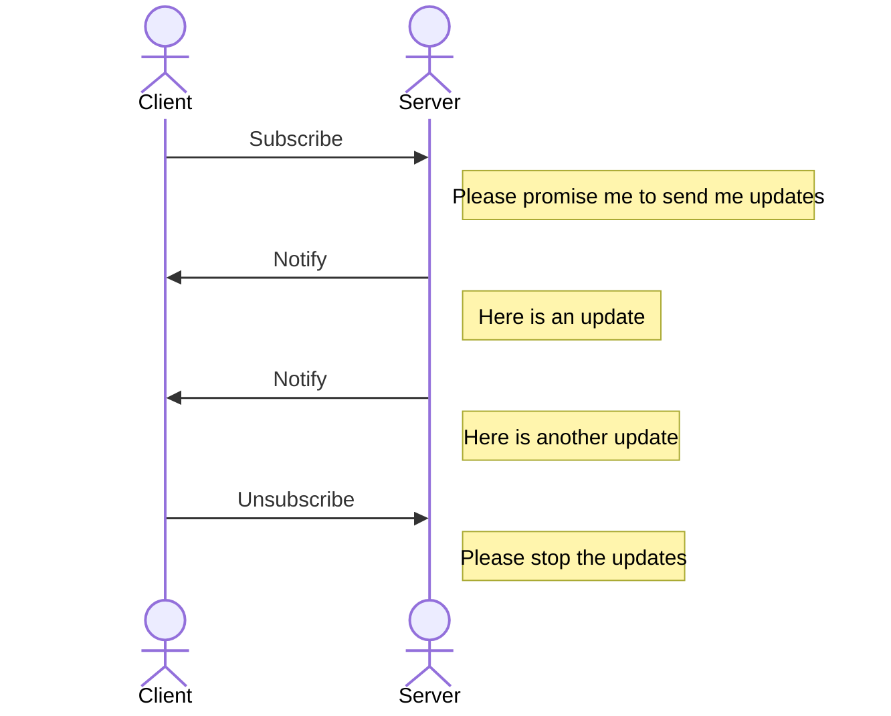
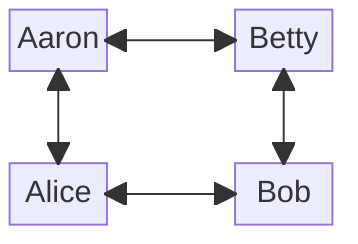

Promise theory helps us understand commitments that actors make.
The basic interaction handles one transaction, as we saw earlier.
But there are many variations.

Instead of just having a single transaction, you can have a sequence, through the "subscribe" pattern.
In this pattern, the provider says: "I promise to update you whenever something interesting happens, until you unsubscribe, or I am finished."
Interest could derive from a specific event, or just enough time having passed.
Examples include subscribing to a magazine or newsletter.
Under the hood of chatbots there is often also a subscription at work, where the LLM gradually delivers your answer as it is being produced ("completion").

### The in-between actor

So far, we have looked at the interaction between two actor types: a provider and a consumer, also known as server and client.
Of course, there can be many instances of both of these, in the same way that a website has more than one visitor, and a web browser is used to visit more than one website.

More interesting architectures and business processes appear when we look at actors that are *between* other actors.
These stand between providers and consumers, and identifying them is a great tool to understand and design complex interaction flows.

Your internet router or WiFi base station is a simple example.
It takes data packets from the many devices on your internal network, sends them to the internet, and vice versa.
If you dig deeper into the internet your provider is also an intermediary as it bundles many other networks to connect to your network.
That is why it is called the "internet" in the first place.

A waiter in a restaurant is also an intermediary.
The promise of the waiter to the customer is that they'll take their entire order, and bring it to the bar and the kitchen, and whatever else is part of the service.
That is more efficient than every customer talking directly to the kitchen.

The whole point of intermediaries is that they should add value between providers and consumers.
Often this takes the shape of taking over some of the work that is done by the other actors and making it better and cheaper through economies of scale.

Each actor in a supply chain is effectively an intermediary.
Think of the supply chain that is behind the waiter in the restaurant.
There is the chef, there is the vegetable market, there is the farmer.
All deliver a specific service with certain quality promises.
Most of them have multiple providers and multiple consumers.
Each provides value to the next actor in the chain.

An important set of intermediaries is search engines and directories.
They connect information sources (providers) with information sinks (consumers), by providing an index of information.
Providers update information on them in the index, consumers look up information in the index.
The internet is full of these: Google search, DNS, link farms, the list is endless.
Outside the internet, an auction is also essentially an index.

The promise of an index is twofold.

1. To the consumer: I'll help you find the provider you are searching for.
2. To the provider: I'll help you being found by consumers.

An index, strictly speaking, does not relay information or goods itself.
After the lookup operation, the consumer contacts the provider directly.
Note that this promise does not state how helpful the index is going to be.
That may depend on money involved, or other considerations, the index may be transparent or opaque about it, and this is one of the ways in which the index exercises power.

Another broad category of intermediaries is relays and routers.
They take information from one actor and handle it in some way to make it more suitable for other actors.
For example, a mail server stores messages until the next mail server is ready to handle them.
A load balancer distributes requests over a pool of servers, so none of them get overloaded.
They promise to move messages closer to their destinations.

A related category is filters, which you can think of as conditional relays.
A firewall filters out bad traffic.
More generally, Policy Enforcement Points (a concept used in many security architectures) filter traffic, for example by checking each party's rights and entitlements in a directory.
This is how the access to just about any SaaS service is controlled, for example.
The core promises are about preventing unwanted messages to propagate.

In the orchestrator pattern, the intermediary delivers a service by combining the services of multiple actors, who each contribute their own part.
Agentic AI systems often follow this pattern.
In step one the question is analyzed for intent, and based on that the question is routed to an appropriate sub agent.
The promise of the orchestrator is that it will do whatever is needed to create a complete response out of components.
This may involve failure or exception handling, for example.

Now we can combine some of the patterns above.
A podcast directory is a subscription service on an index.
Whenever a new episode is published, it will notify the subscribers to that episode, but it does not store the episode itself.

A final type of intermediary discussed here is brokers.
Brokers promise to decide on or arrange transactions, instead of just informing on them.
Common examples are insurance brokers and stock brokers who find the best deals for a given customer.
I ran into a nice example in the internet advertising space a while back.
A website shows your browser a page with some space that can be sold to fit an advertisement.
It sends that opportunity to an ad broker together with relevant information on the ad (e.g. height and width)
and audience (i.e. you, your location, demographics, and whatever information the website can lay its hands on about you, maybe through cookies).
The ad broker is an internet service that solicits bids made by potential advertisers.
The winning bid gets displayed in the website.
The whole process takes less than a second.
It is instructive to draw the time-sequence diagram of this entire process, and to review the (conditional) promises that are being made here.

### Intermediaries have power

Because these intermediaries control the flow of information, they have power.
They can filter, alter or block traffic, and very selectively so.
They can store and protect valuable information.
Some intermediaries are so important that digital infrastructures effectively cannot operate without them, DNS is an example, as are number authorities in general.
The number authority system decides if you get an IP address, and without an IP address you can't connect to the internet.
Likewise, DNS decides whether you have a domain address.
Without one, you can't have a URL on which your website can be found.
You might rebut and say, I will just host my website on a subdomain of a website hosting service.
But now you are subject to the power of DNS as well as the power of the hosting service.

Wherever there is power, there are power conflicts and the need for governance to resolve these conflicts.
The governance structure around IANA (Internet Assigned Numbers Authority) is interesting to study.
The European Union has issued the second Directive of Network and Information Security, NIS2, in 2022 specifically to govern these types of intermediaries.

Let's have a look at some more intermediaries.

### Supply Chains

We already saw the restaurant waiter who sits downstream from a number of intermediary actors, and somewhere in that chain there is a farmer.
Every supply chain actor has their role, adds some value, and tries to exercise some power.
Most actors in a supply chain carry some form of stock.
This could be physical stock (inventory) or it could be work in progress.

In reality, there is not one chain, but it is a whole network of actors.
These networks can also change over time.
Here is a specific example of that.

Your IT workloads are run on servers.
What is the supply chain for these servers?
Somewhere upstream, processing and memory chips are being made.
They get assembled into boards, and then into servers and server racks, after which they are provisioned to you.
Historically, your IT department ordered those boxes, typically dictated by project needs.
While somewhat driven by demand, those servers would even be idle a lot of the time.
This represents an unused inventory of capacity.
Cloud computing changed that, and that inventory is now wholly managed by the cloud provider.
And with that, power changes.
The IT department now has the power to more quickly provision capacity,
the cloud provider now has more control over the way that the provisioning is done.

In his book Designing Delivery, Jeff Sussna argues that a common pattern of innovation in business is to change the boundary, the handover point, between parties in a supply chain, often by a supplier providing additional services to a consumer, as the cloud computing example demonstrates.

### Beyond Intermediaries: Delegation Domino

Now for a situation with multiple actors where the intermediaries are a little less clear.
Imagine there are two companies who are trying to collaborate on a digital service that
they are providing to each other.
So it's not a typical supplier/customer relationship, but these organizations try to collaborate.
But when it comes to operationally making that collaboration work, it runs into difficulties.
Suppose that there is an operational problem that requires a service desk from one of the companies to get something done from a service desk from the other company,
let's say, some insight in why a certain connection does not work.

The service desk that receives that call may not know how to handle it.
In fact, they may not even consider it their job to handle that call.
Trust me, I have seen this happen in real life, and it can happen to you too.
You try to get the job done, but you are not getting anywhere.
The other side isn't cooperating, even though you know that what you want is in their organization's best interest.
This behavior is in good faith, and in fact in line with their job description and experience.
Service desks that handle calls outside their defined competence will be ineffective or overloaded, or both.

So, how does this work, given that there is no clear supplier/customer relationship?

There should be a contractual agreement between the two companies,
and that agreement should be translated into operational agreements.
But companies don't make agreements, people make agreements on behalf of companies.
That is the reality: companies are legally represented by certain people.

This is a case I ran into many years ago, except it was between six companies with three layers of management (as far as I could see).
For the sake of argument I have simplified the example to two companies.
When I started to use promise theory, I could see the patterns, and I could see the way out.

Here is how this details out.
Let's give names to the people involved.

Aaron and Betty are the CEOs of their respective companies, and they want their companies to work together.
Alice is the system admin of Aaron's company, and Bob has that position at Betty's company.

As I explained in an earlier unit, neither Aaron nor Betty can force the other to do anything,
they can only negotiate a contract that consists of complementary promises.
Similarly, they cannot force their employees to do one thing or another.

What then does this look like in promise theory?
The answer is that this needs a promise, which in itself takes the form of a request for a promise from another party.
Here is what some of the promises look like:

> CEO Aaron to CEO Betty: please promise to me that Alice can talk to Bob when I have a service request

> CEO Betty to Bob: please promise to me that you promise to Alice to pick up the phone when she calls

The diagram shows how the establishment of promises works.
The bidirectional arrows represent the negotiation behind each promise.

When I wrote language like this into the service agreements, the cooperation between the companies started to work.

Is this "Delegation Domino" pattern a type of intermediary?
I find that surprisingly hard to answer.
From the perspective of Aaron in this example, Betty is an intermediary to get to the results his company is looking for.
And in a similar way, Aaron is an intermediary for Betty and her company.
You may find that concocted, and operationally, Alice talks directly to Bob.

Nevertheless, chaining promises like dominoes has worked for me in quite a few situations.