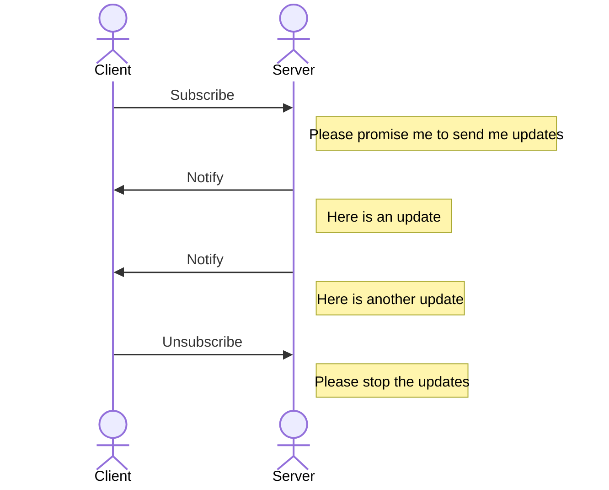

Promise theory helps us understand commitments that actors make.
The basic interaction handles one transaction.
But there are many variations.

Instead of just having a single transaction, you can have a sequence, through the "subscribe" pattern.
In this pattern, the provider says: "I promise to update you whenever something interesting happens, until you unsubscribe, or I am finished."
Interest could derive from a specific event, or just enough time having passed.
Examples include subscribing to a magazine or newsletter.
Under the hood of chatbots there is often also a subscription at work, where the LLM gradually delivers your answer as it is being produced ("completion").

### The in-between actor

So far, we have looked at the interaction between two actor types: a provider and a consumer, also known as server and client.
Of course, there can be many instances of both of these, in the same way that a restaurant waiter serves more than one customer, a website has more than one visitor, and a web browser is used to visit more than one website.

More interesting architectures and business processes appear when we look at actors that are *between* other actors.
These stand between providers and consumers, and identifying them is a great tool to understand and design complex interaction flows.

Your internet router or WiFi base station is a simple example.
It takes data packets from the many devices on your internal network, sends them to the internet, and vice versa.
If you dig deeper into the internet your provider is also an intermediary as it bundles many other networks to connect to your network.
That is why it is called the "internet" in the first place.

A waiter in a restaurant is also an intermediary, they bundle customer requests and bring them to the bar and the kitchen, and whatever else is part of the service.

The whole point of intermediaries is that they should add value between providers and consumers.
Often this takes the shape of taking over some of the work that is done by the other actors and making it better and cheaper through economies of scale.

Each actor in a supply chain is effectively an intermediary.
There are numerous actor types, and they can be distinguished by the promises that they make, implicit or not.
Those promises result in value to the consumers and providers, ideally.

As a thought exercise, you can think of the promises that all these intermediaries make.

An important set of intermediaries are search engines and directories.
They connect information sources (providers) with information sinks (consumers), through an index of information.
Providers update information on them in the index, consumers look up information in the index.
The internet is full of these: Google search, DNS, link farms, the list is endless.
Outside the internet, an auction is also largely an index.

The promise of an index is twofold.

1. To the consumer: I'll help you find the provider you are searching for.
2. To the provider: I'll help you being found by consumers.

An index, strictly speaking, does not relay information or goods itself.
After the lookup operation, the consumer contacts the provider directly.

Another broad category of intermediaries is relays.
They take information from one actor and convert it in some way to make it more suitable for another actor.
For example, a mail server stores messages until the next mail server is ready to handle them.
A firewall is also a relay, it filters out bad traffic.

Now we can combine some of the patterns above.
A podcast directory is a subscription service on an index.
Whenever a new episode is published, it will notify the subscribers to that episode, but it does not store the episode itself.

A final type of intermediary discussed here are brokers.
Brokers promise to decide on or arrange transactions, instead of just informing on them.
Common examples are insurance brokers and stock brokers who find the best sellers for a given customer.
I ran into a nice example in the internet advertising space a while back.
A website shows your browser a page with some space that can be sold to fit an advertisement.
It sends that opportunity to an ad broker together with relevant information on the ad (size, aspect ration)
and audience (i.e. you, your location, demographics, and whatever information the website can lay its hands on about you, maybe through cookies).
The ad broker is an internet service that solicits bids made by potential advertisers.
The winning bid gets displayed in the website.
The whole process takes less than a second.
As another exercise, try to draw the time-sequence diagram of this entire process.

### Intermediaries have power

Because these intermediaries control the flow of information, they have power.
They can filter, alter or block traffic, and very selectively so.
They can store and protect valuable information.
Some intermediaries are so important that digital infrastructures effectively cannot operate without them, DNS is an example, as are number authorities in general.
The number authority system decides if you get an IP address, and without an IP address you can't connect to the internet.
Likewise, DNS decides whether you are have a domain address.
Without one, you can't have a URL on which your website can be found.
You might rebut and say, I will just host my website on a subdomain of a website hosting service.
But now you are subject to the power of DNS as well as the power of the hosting service.

Wherever there is power, there are power conflicts and the need for governance to resolve these conflicts.
The governance structure around IANA (Internet Assigned Numbers Authority) is interesting to study.
The European Union has issued the second Directive of Network and Information Security, NIS2, in 2022 specifically to govern these types of intermediaries.

