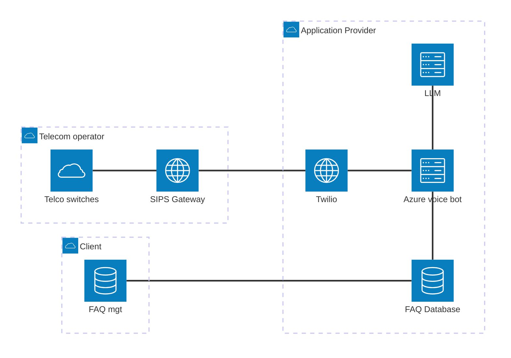

Let's look at a practical example from one of my clients.
It handles voice calls using an AI-supported chatbot.

Who is actually responsible for what?
This is important for a number of reasons:

- it allows us to set responsibilities for management and security
- it helps us when we draw up contracts and service level agreements
- it is a great start for threat modelling, for example in understanding where identity based permissions cross organizational boundaries.

In the [unit on AI roles](/book/diginfra/ai-roles/) we look at the way this maps to the allocation of controls
over various actors.

At the highest level we have three organizations, each with their own control boundary.
All technology is managed by an organization, whether or not they own it directly.

The three major domains here are:

- the telecom operator, handling customer calls, but not the conversation
- the application provider (backend), integrating the components of the application
- the client, maintaining the frequently asked questions (FAQ) database that the voice bot draws its answers from.

Twilio is a third-party service, but it falls within the control boundary of the application provider.
The application provider is responsible for selecting, contracting with, and operating Twilio, a cloud communications platform.
The client simply benefits from the capability it provides.

An incoming call would be routed by the telecom operator through the SIPS gateway over the internet to the backend.
In the backend, Twilio handles the call, and routes that voice message to the voice bot.
The voice bot uses an LLM to interpret the user's question and generate an answer, based on the FAQ.

The client is responsible for keeping the FAQ database up to date.

There is a lot more under the hood:, management, logging, billing, reporting and more.
None of that changes the ownership picture and the core architecture.
Its main purpose is to show the *organizational control boundaries* that help us manage the *technical components*.
The goal is not to map every nook and cranny, but to figure out who needs to pick up the phone if something breaks.
