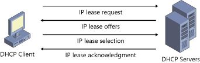

Customer service is a great thinking model for a lot of what is going on in digital infrastructures, even if the customer is not a human, as we will see.
We are often buying products, but we really mostly want a service.
In an earlier unit, we talked about promise theory

An IT services organization deals with customer requests all the time.

>Can I get a new laptop?
>
>Joe from accounting needs permissions to access this application. Can you fix that?
>
>I think I clicked on a phishing link. What now?

The list is endless.

Most of these scenarios can be described very nicely with promise theory.

Q: Can I get a unique IP address?
R: Here is your address, let me know when you are done with it

A: thank you, I am done with this address

Example IP addresses allocation

Example TCP/IP
picture

Connect
Q: can you reserve buffer space for a connection?
R: yes we promise, here is your initial window size
A: thank you, here is your initial window size

Transmission
Q: please accept this data
A: thank you, I will forward it, here is your new window size

Rinse and Repeat
=-

Service elements: consumer actions and provider responses 

Every service has multiple components/elements, i.e.
Access resource (login, get webpage, …)
Create resource (server, virtual disk, mailbox, …)
Modify resource (bigger disk/mailbox, new functional module, add friend, …)
Create user (provisioning)
Create account
Talk to a sales representative
Negotiate and set up contract
Reset password
Delete account
Delete data (deprovisioning)

Generally: anything that can be governed by a permission or can lead to a commitment or obligation

Hierarchy of services
Extra note: can you group these in phases: contract, provision, use..
Contract (start – end)
Provisioning users within a contract, deprovision
Using resources by a user

