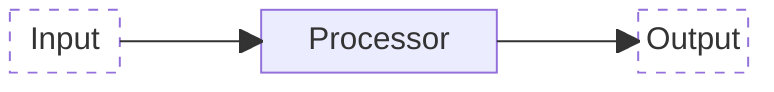
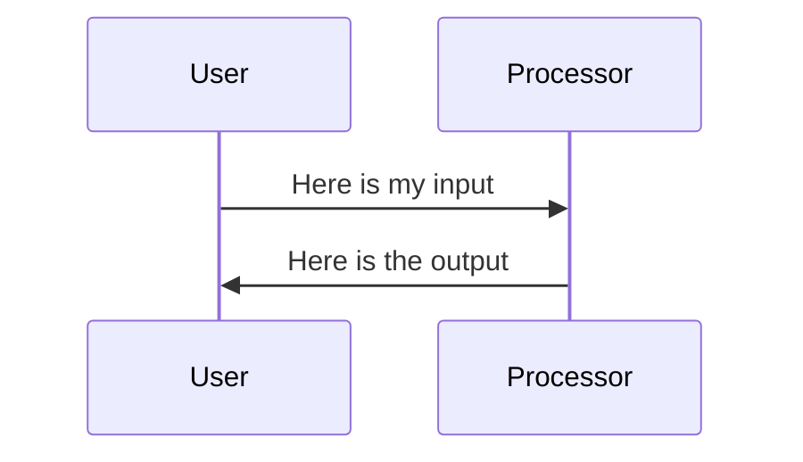

It all starts with bits: digital units of information. It is about how we store these bits, how we move these bits, and how we transform or process these bits.

The three major elements of digital infrastructures are:

1. Storage
1. Networks
1. Processors

In the cloud security world, it is customary to talk about data at rest, data in motion, and data in use. This introduces data as the key common element. But more on cloud security later.

All of these elements have a wide variety of different manifestations, with associated quality and performance attributes that matter enormously in the design and management of digital infrastructures.

You'll also have to understand that these three concepts are very entangled. A storage system is connected to a network, but it also has network and processing elements inside. The same is true for the other two concepts. Once again, it is a way to draw maps of digital systems, and any map is inaccurate. As said elsewhere, this inaccuracy actually can make it a good map! It reduces complexity so that we can more easily think about it.

Speaking of maps, a variety of diagrams is used in the field of IT.
I'd like to gently expose you some of those diagram types.

The link between the digital elements is, in its simplest form, often depicted as follows:

A few comments on what this does, and does not show:

- input is data, which is _transformed_ into output, also data
- the diagram does not show if this is a one-off activity, or a stream of events, we need a time-sequence diagram for that
- there is no explicit mention of any 'state' or 'persistent data' inside the processing.

We will see later how this simple model is adequate to describe a vast variety of data processing tasks.
A very simple example is adding two numbers. The input is formed by the two numbers, and the output it their sum.
An AI example might be the input a voice recording, and output a file with the transcribed conversation.

In an interactive world, it is more common to have the output returned to the source of the input.
The following diagram illustrates that.

A common example would be to send as input a question to a search engine, where the search results are the output.
The vertical lines are _timelines_ that show from top to bottom how time flows, and what the sequence of interactions is.
That is why we call these _time sequence diagrams_ (TSD).
