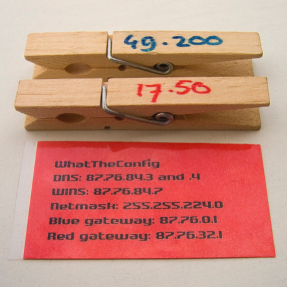
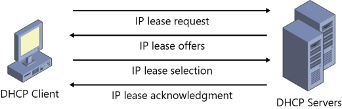

origin story promise theory

suwinet
reisplanner

design patterns

customer sevice, can I get a new app/user account

Q: Can I get a unique IP address?
R: Here is your address, let me know when you are done with it

A: thank you, I am done with this address

Example IP addresses allocation

Example TCP/IP
picture

Connect
Q: can you reserve buffer space for a connection?
R: yes we promise, here is your initial window size
A: thank you, here is your initial window size

Transmission
Q: please accept this data
A: thank you, I will forward it, here is your new window size

Rinse and Repeat
=-

Service elements:consumer actions and provider responses 

Every service has multiple components/elements, i.e.
Access resource (login, get webpage, …)
Create resource (server, virtual disk, mailbox, …)
Modify resource (bigger disk/mailbox, new functional module, add friend, …)
Create user (provisioning)
Create account
Talk to a sales representative
Negotiate and set up contract
Reset password
Delete account
Delete data (deprovisioning)

Generally: anything that can be governed by a permission or can lead to a commitment or obligation

Hierarchy of services
Extra note: can you group these in phases: contract, provision, use..
Contract (start – end)
Provisioning users within a contract, deprovision
Using resources by a user

Servive quality
e.g. response time. fulfillment time.
Fulfillment time: months, weeks, days, minutes, seconds, …

These quantitative measures can be used as Key Performance Indicator (KPI) metrics in a Service Level Agreement (SLA)

Average response time for primary service
Provisioning latencies of users, instances, network, disks
Minimum/maximum volumes
Cost per user; typically registered user, not per concurrent user
Latency and volumes of calls.
Network latency by location
Software resources (e.g.  # connections)
Incident response times
(and so on)
(kan wellicht met mermaid annotations)

Defines the qualitative and quantitative parameters of the service
Contains promises
Translate to assurance obligations
Translate to penalties

Within larger corporations internal consumer/providers relations exist, which also require internal SLA’s

exercise: Match the service element to the service model (SaaS, PaaS, IaaS), if any

Get webpage from Intranet
Create email
Create mailbox
Add virtual disk
Ask external service to process a payment (in webshop)
Request rack in data center

Manage the CMS content
Configure the CMS
Manage and maintain CMS code base
Manage webserver and application platform
Manage database
Manage operating system
Manage hypervisor
Host hardware

Intermediaries, brokers. 3 actortypes (or more)

An intermediary adds value between client/server, source/sink
I.e. index, filter, conversion, (de)couple
(e.g. Relate to ’broker’)
Indexen
Gebruikersadministratie, ten behoeve van autorisatie en TTP diensten
Abonnementadministratie, welke afnemers of belangstellenden zijn er?
Bronindex, welke bronnen hebben informatie over een bepaald sofinummer (search engine)?
Functionaliteit
formaat conversie, filtering
vraag/aanbod matching
Performance
verdelen en routeren van berichten, multicasting
aggregatie
caching
bundeling van afspraken (bijv. SLA)
- distributor/directory
authorization
choice / arbitration / load balancer
service integration
pubsub. Intermediary holds source and subscriber directories. Notice the various commitments that can be made. Examples: newsletter, podcast subscription
multicast

subscription toepassing: chatbots streaming?

Pattern composition: Tell me the current state, 
subject to authorization intermediary, 
then subscribe me to changes

indexesEen bronindex houdt bij waar welke informatie beschikbaar is
Een abonnementindex houdt bij waar afnemers van informatie zijn

History and books.
Cfengine
21 "/var/cfengine/bin/." 
22   create => "true", 
23   perms => usystem("0700");
(idempotent operations... of is dat iets anders?)
“I promise that the directory will have permissions 0700 or report my failure"

=-
service agreements
A lot of service management is about organizing promises, evolving them, and managing the risks of not keeping them.

You not keeping them
Your providers not keeping them

We promise to prevent unauthorized access
We promise to keep your information safe
We promise to maintain according to vendor best practices
We promise to make sure that there is a spare copy of your data off site
We promise to add resources as needed
We promise to apply updates and improvements
We promise to have trained staff that reacts timely and professionally

= risk and security
Every promise is a risk:
    failure 
    deception

Security can also be about information leakage: I promise to not tell

DDOS: denial of service
Resource exhaustion

If a promise implies a resource reservation (commitment), and the amount of resources is finite, denial of service is a realistic risk
Examples:
TCP connections
Processing capacity

Chain gang: 
CEO Aaron to CEO Betty: please promise to me that Alice can talk to Bob when I have a service request

CEO Betty to Bob: please promise to me that you promise to Alice to pick up the phone when she calls

Composition and supply chain. (restaurant waiter, chef)
Dynamics of supply chain, jeff sussna.

Service managemnet is organising the keeping of promises.
What is the role?
Which promise does it keep?
What are its clients and providers?

I.e. Change management (ITIL)
Promise to keep an asset inventory
Promise to process change requests on the basis of a change policy

Change management (ITIL)
Promise to process change requests on the basis of a change policy
”I promise to allow changes that meet change policy requirements to promote to production”
Can be manual or automatic or automatic with exceptions

Nog meer leftovers:

end to end applicatie performance meten. Hoe. Link met SRE

Service example 
Type of organization: Public Government
Challenge: procurement process spread over 171 agencies, 
most having their own IT systems, 
controlling $3B procurement
Approach: Community SaaS procurement system (Ariba)

Procurement by hundreds of government agencies, served by thousands of suppliers

What is the data, what are the service elements?

Contractual framework in promises
General terms and conditions
Service Agreements
Service Level Agreements (SLA)
Acceptable Use Policy (like a reverse SLA)

=> Contracts are the interfaces in the supply chain and should be matched to GRC requirements
