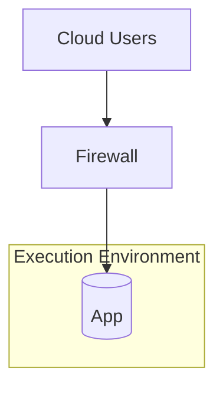

Zero Trust Architecture is an approach to better cybersecurity. To many, it seems daunting to implement. But it does not have to be hard to start.

Consider this hypothetical situation.

You have an application with hundreds of thousands of sensitive records, let’s say client records. We assume that in this example it seems hard to implement MFA (Multi Factor Authentication) on it. What other controls can you implement to reduce the assumed trust? We can use the Kipling method, which is at the core of Zero Trust architectures, to engineer better controls. In short, the Kipling method is about the 'who', 'what', 'when', etcetera of allowed communication.

We want to allow specific access for specific use cases and be explicit about it. However, to focus our efforts, it makes sense to also identify that our biggest risk is the exfiltration of a lot of those sensitive records: a data breach.

## The allow rules

Let’s begin with the ‘who.’ Who is accessing the information? The application in our example probably does authentication and authorization of users. Where do these come from, and how accurate is that information? Ideally, this comes from an up-to-date corporate directory, but even if it’s not, you can, for example, ask how quickly a departing user has their access revoked.

Then the ‘what’. Which application and resources are we accessing? What are specific users allowed to do? As part of operational risk management, we have probably already identified who, based on their role, can modify records or do other critical actions. But think one step further. As our main fear is exfiltration of large amounts of data, we can look at where we can control that. Maybe we can disallow large downloads, for example, except when a timely ‘four eyes’ approval is in place.

(By the way, I think it makes sense to look at large downloads as a risk separate from small data leaks. After all, many employees have access to small amounts of information, and that risk is typically already accepted).

Moving on to the ‘when’. It can reduce risk to limit access to specific times of the day for most users. There is not necessarily a reason to allow more.

Next is the ‘where’. Where are the users and the application located? Our case description does not give us a lot of information here. The application could be a server, which then has an IP address. And through a firewall combined with a geographical information feed, we may be able to restrict access to users based on their location.

The ‘why’ stands for the business reason. In this case, our data is sensitive, and we don’t want it to be exfiltrated. And in our analysis, we have identified several possible controls.

How: One layer of enforcement of this would be in the application itself. In the Zero Trust jargon, we are putting a Policy Enforcement Point in the application logic.

## The mirror allow rule

However, there is also another set of ‘allow rules’ that is often overlooked. I am tempted to call these the ‘mirror’ rules, but it is not a standard Zero Trust term.

The data and the application reside in a compute environment, for example a server. There may be malware running in that server. After all, one of the tenets of Zero Trust is ‘assume breach’. If the server has permission to access anything on the internet, that malware might easily exfiltrate large amounts of data.

In addition to looking at the user accessing the data, we are looking at the place where the data resides and see if its compute environment can access the world, and thus exfiltrate data. This is the mirror image of the first rule: you could say that subject and target are switched around.

We can apply the same Kipling method from the perspective of that server (or any compute environment that has the data in it). What is it allowed to do?

The ‘who’ then is the server, and there are various ways to identify it, depending on how it is set up and how we want to control what it can do. It can be an IP address or domain name, for example.

What can the server access? The more limited that is, the better. It should probably be capable of logging somewhere, but it needs only limited DNS and internet access. There are likely to be integrations with other systems, but these should be enumerated and controlled.

When can the server initiate contact? This seems less relevant to restrict, because logging and many integrations can be operational at any time.

Why is this access needed? As said earlier, any compute environment must be able to connect to certain other services for its functional operation. Yet that does not imply that it needs broad uncontrolled network access. And there are known cases of abusing overly permissive egress.

How can this rule be enforced? One way would be at the outer perimeter of the network, although it is also conceivable to do it through a dedicated firewall or a (network) security group in a cloud environment.

## What is the benefit here?

In this example we have looked at a specific case of data that we want to protect. The Zero Trust approach and the Kipling method led us to various options that we have. These options allow us to hammer out implicit trust in an existing application.

The nice thing is that we can rate and rank these options based on their effectiveness, cost, and feasibility, all while focusing on one specific strategic asset that we want to protect. This is in stark contrast to a traditional approach where you start with strengthening the perimeter and just hope that this will have an impact on the one application that you want to protect first.

And we all know: hope is not a strategy.

## Implication for maturity

What we can also illustrate with this story is that, even though we can start with an individual application, many of these controls will become better and cheaper if there is some maturity and shared services in the organization. Reliable user identities are helped by proper federated identity management. Fine grained network access rules are easier to do if there is more software defined networking.

Maturity is an investment, and it pays off in cheaper, faster and better security. That is another tradeoff that this example illustrates.

For more information on Zero Trust, visit <https://cczt.clubcloudcomputing.com>

Also published at <https://www.linkedin.com/pulse/retrofitting-zero-trust-existing-application-peter-hj-van-eijk-zjpte>
