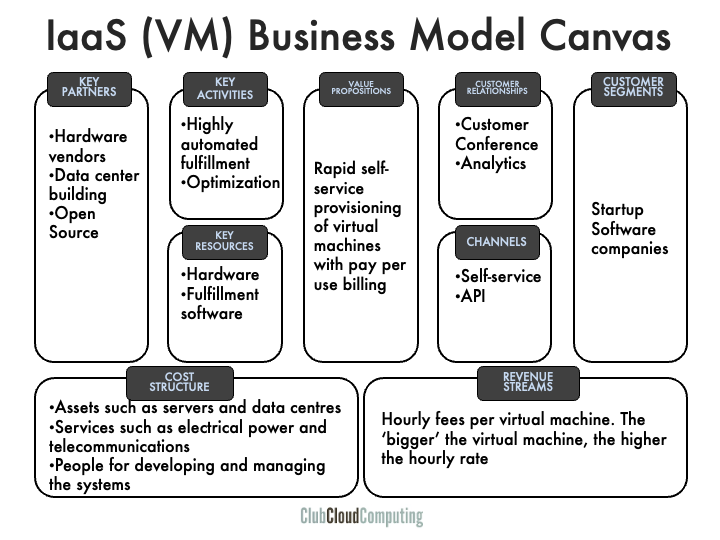

## Business Model Canvas

The business model canvas is a visual template for developing and discussing business models. For more information, see <http://en.wikipedia.org/wiki/Business_Model_Canvas> and <http://www.businessmodelgeneration.com/>.

The business model canvas has nine basic building blocks and specific relations between those blocks. I'll illustrate them here.

The example used in this section is Amazon Web Services (AWS), particularly EC2 (virtual machines on demand). This is an Infrastructure as a Service offering. The power of the business model canvas approach becomes clear when we see how it can distinguish between various cloud service offerings.

## Customer Segments (CS)

Customer segments are the groups of customers that the company ultimately serves, i.e., the ones that consume and pay for the services.

In the AWS case, although practically anybody with a credit card can spin up a virtual machine, in 2015, Amazon primarily targeted software developers and (startup) SaaS providers as the main customers. Historically, the Amazon development teams were the first customers, and external customers were initially added as an afterthought.

## Value Propositions (VP)

Value propositions reflect customer problems and needs. This central element describes why the customer would ultimately pay for the product or service.

The value proposition of a cloud computing service is driven by its five essential characteristics. For example, in the AWS EC2 case, the core component of the value proposition is rapid self-service provisioning of virtual machines with pay-per-use billing. For each individual customer, these translate into different business advantages, like fast provisioning, reduced capital expenditure, and minimized risk of over-investing.

## Channels (CH)

Value propositions are delivered to customers through communication, distribution, and sales channels.

It is often assumed that cloud computing relies solely on self-service direct sales, but the reality is much more diverse. SaaS providers, in particular, are developing extensive partner programs. AWS primarily employs a self-service direct model, where delivery is through APIs. The model is enhanced by premium support.

## Customer Relationships (CR)

Customer relations are established and maintained with each specific customer segment.

One way AWS maintains relationships with its customer segments is through conferences. The 2013 re:Invent developer conference attracted 9,000 visitors. In 2024, the conference, no longer solely focused on developers, drew around 60,000 visitors. Additionally, there are vibrant online communities.

## Revenue Streams (RS)

Revenue streams result from value propositions that are successfully offered to customers.

The structure of revenue streams is where cloud computing differs from earlier IT service models, as they are usage-based rather than asset-based. AWS charges hourly fees per virtual machine; the bigger the virtual machine, the higher the hourly rate.

## Key Resources (KR)

Key resources are the assets required to offer and deliver the previously mentioned elements (e.g., value proposition, customer relationships).

AWS owns massive amounts of hardware, estimated at 1 million servers or more in 2015, housed in dozens of data centers worldwide. But there is more. The service can only be delivered through advanced and unique fulfillment software and processes.

## Key Activities (KA)

At AWS the key activity, delivery, is highly automated. But at the AWS scale, oversight and resources
planning is still a significant effort. Optimizing assets versus utilization is very essential in the IaaS
business model. Through economies of scale, AWS is able to spend a lot of effort on these activities.

## Key Partnerships (KP)

Some activities are outsourced, and some resources are acquired outside the enterprise.

AWS buys immense amounts of hardware, and uses a lot of (open source) software. Building out data
centers is also likely to be outsourced.

## Cost Structure (CS)

All business model elements discussed above impact the cost structure.

In more traditional IT service models the revenue streams are tightly coupled to the cost structure. The
cloud computing innovation is also about decoupling these.
At AWS, the main cost elements are in assets such as servers and data centers, in services such as
electrical power and telecommunications, and in people for managing the systems.

## Summary

The business model canvas is a useful tool to map out the particulars of cloud provider business models. In this section, we have only looked at the basics of a particular infrastructure provider. For software-as-a-service providers and internal/private cloud providers, the canvas can also be used to discuss their differences.
