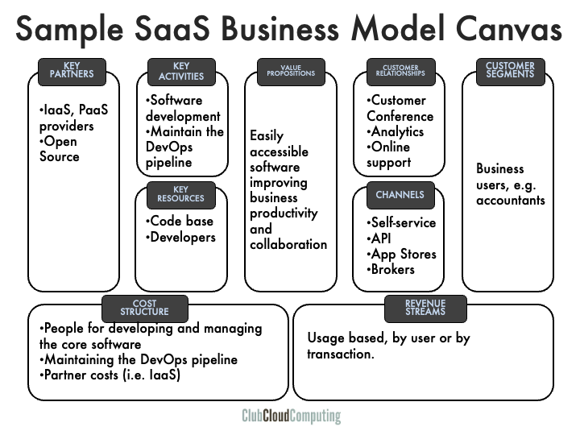

Here is a high-level overview of the SaaS provider business model and some of the strategic options that are in there.

### Business Model Canvas

 In this unit, we'll explore examples using two hypothetical SaaS providers: one offering bookkeeping software and the other a project collaboration platform.

### Customer segments (CS)

In the Business Model Canvas, “Customer Segments” are the groups of customers that the company ultimately serves, I.e. the ones that consume and pay for the services.

It is characteristic of the SaaS model that this could basically be anybody, not just IT people. Let us just remind ourselves that customers here are the ones that use the service to get their business done, or get their personal lives in order. In a business context we often also have to distinguish between the user and the organization that purchases the solution. This is very likely true in the case of our bookkeeping software company.

### Value Propositions (VP)

Value propositions reflect the customer problems and needs. This is the central element that describes why the customer would ultimately pay for the product or service.

The essential characteristics of cloud computing may or may not relate directly to the core value proposition of the software application. In our first example, the core value proposition —automated bookkeeping— is unrelated to cloud computing. Of course, cloud computing’s characteristics give the SaaS proposition an edge above its direct on-premises alternatives even if the functionality would be the same. Self-service provisioning leads to quicker time to deploy, more scalability in usage (whether accounts or transactions), lower investments or commitments, and potentially lower cost.
The value proposition is fundamentally different in the second example, the project collaboration support site. In this example, the cloud's characteristic of broad network accessibility directly enhances the software's usefulness for users spanning company boundaries.
Interestingly, the first provider could use this insight to extend its functionality beyond what would be possible in an on-premises solution. Think collaboration with accountants, suppliers and possibly customers, or channel partners.

### Channels (CH)

Value propositions are delivered to customers through communications, distribution and sales channels.

It is often assumed that cloud computing relies solely on self-service direct sales, but the reality is much more diverse. SaaS providers in particular are developing extensive partner programs.
The typical enterprise software solution is not implemented overnight. It takes attention to change management and alignment on master data for example. That is why system integrators often experience the move from on-premises to SaaS as relatively painless. They are doing the same job on a different environment.
Less invasive SaaS offerings are frequently aggregated in broker portals, commonly referred to as 'enterprise app stores.' These portals add value through consolidated billing, self-service provisioning, identity management, and potentially some data integration. But that is one to paint on another business model canvas.

Another natural extension of the SaaS model is exposing the core functionality through an API. While not often directly accessed by the consumer, this does allow integration with other SaaS providers. Our project collaboration software could integrate with an existing cloud storage provider.
The main SaaS channels therefore are direct self-service sales, value added re-sellers, system integrators, and enterprise app-stores. The notion of cloud broker fits in here as well, but dissecting its many shapes and forms is a topic beyond the scope of this section.

### Customer Relationships (CR)

Customer relations are established and maintained with each specific customer segment.

The lure of cloud computing is that the provider can have a much more direct relation with the customer than is possible with an on-premises solution. Technically, the provider can potentially see each and every move from the users. Which software builder would not like to be able to see the popularity of every feature in real-time? This allows for much more rapid innovation cycles.

It is not impossible for the loop from idea to wide customer feedback to be closed in a couple of hours.
However, this power can bring the provider in conflict with the consumer who might object to its data being used. As an example that is close to the limit of what might be considered acceptable consider the following case.
An on-line bookkeeping service for individuals allows them to categorize payments to merchants. Once enough individuals categorized Danny’s steakhouse as a restaurant, this can then also be suggested to other clients of Danny’s. Is it legal to use data from one cloud consumer to deliver value to another? Generally speaking, the answer is no, but it may be acceptable if only aggregate data is used.
Support is often easier on-line, and on-line communities often add considerable value for the consumer.

### Revenue Streams (RS)

Revenue streams are the result of value propositions that are successfully offered to customers.

The structure of revenue streams is where cloud computing differs from earlier IT service models. Software firms traditionally relied on licensing arrangements that were somewhat usage based, and could be hard to enforce technically as well as legally.

Cloud computing service models by definition are usage based, and have the potential to be much more closely related to the value that is experienced by the customers. Both our examples enhance the productivity of users, and it is natural to charge per user who has access to the functionality on daily basis. Transactional services such as event management or email delivery are more naturally charged by the transaction, potentially on a bulk basis.

### Key Resources (KR)

Key resources are the assets required to offer and deliver the previously mentioned elements (e.g. value proposition, customer relationships).

The core asset of a software company is likely to be its code base, its understanding of consumer requirements and processes, and the staff that does this. For a SaaS provider, this is augmented with actual technical service delivery and understanding of consumer behavior.

It may seem a small matter to go from knowing your software and the way it runs at your customer’s sites to running the software yourself. Yet, the competencies involved are fairly different.
The most obvious differences between cloud providers and software delivery companies are in multi-tenancy and feature velocity. Every SaaS provider has to think about how multi-tenant his software needs to be to realize the right scalability model for its customers. Feature velocity, the time between inception and go-live is a great competitive differentiator. To achieve this, the provider requires an integrated 'DevOps' organization, demanding significant input from people, processes, and technology.
Then, on the physical asset side, an important question is how much delivery assets the company decided to have. Does it need to own hardware assets or are they sourced from an upstream cloud provider? On the canvas, this represents a trade-off between resource and partnerships.

### Key Activities (KA)

The key resources perform key activities.

The obvious key activity at a software company is: develop software. In the long run, these should increase the value of the code base. For a SaaS cloud provider, actually delivering the software as a service is an extension to that. The virtuous circle in a SaaS provider is understanding customer behavior and requirements, translating these into new functionality and delivering this to customers.
For this to be successful on the SaaS scale, it has to be executed as an integrated pipeline. The most advanced organizations get the operational activities out of the way. Developers and product managers are empowered to push features to production. Tests are all automated and the focus of operational staff is not so much into bringing features in production, but to maintain the assets and operational fabric that allow the developers to do that themselves.

### Key Partnerships (KP)

Some activities are outsourced, and some resources are acquired outside the enterprise.

A fundamental choice for every software company is ownership of development tools, as the dependence on these is of strategic importance. That is why large software companies used to have their own homegrown development environments. It turns out that the development tools are a source of strategic risk, but not of strategic advantage. As the industry has matured, it turns out that significant portions of these are best moved to an open source model.
An additional fundamental choice for a SaaS provider is: who runs and owns the delivery infrastructure? Again, that infrastructure represents a risk more than a source of competitive advantage. As Netflix puts it: “we are not in the business of building data centers”. That is why it makes sense to work with IaaS or PaaS providers rather than owning the infrastructure. This will obviously also impact the cost structure as we will see.

### Cost Structure (CS)

All business model elements discussed above impact the cost structure.

In more traditional IT service models the revenue streams are tightly coupled to the cost structure. The cloud computing innovation is also about decoupling these.
In software, revenue streams are pretty disconnected from the cost structure. After all, when the software is written, shipping it to customers has very low incremental cost, even though servicing customers has not.
For software as a service this is a little less so, as there is actual infrastructure necessary to support the service.
The cost of that infrastructure is related to the usage volume.

The most significant cost elements related to software development are in creating and maintaining functionality, and in maintaining the development and delivery infrastructure. For the software delivery side there will be costs related to in company server infrastructure or incurred from key partners such as IaaS providers.
Interestingly, for a lot of SaaS companies, most of the development cost is about supporting future customer needs, not current customer needs. An exception could be the bookkeeping firm, which might be tracking tax regulations as they tend to change regularly.

### Summary

Again we see the business model canvas as a good tool to map out the particularities of cloud provider business models.
It points us to provider particularities and indicates some important strategic choices.

See also on YouTube:



