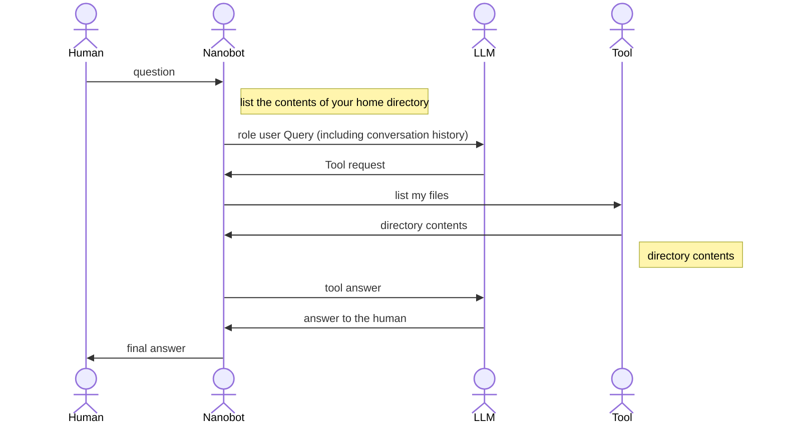

How do AI agents work, is what I am trying to understand these days.
And can we use agents to reason about agents, in particular about *themselves*?

AI agents have a lot of potential for my work, but I am also interested in the security implications.
Because the more powerful they are, the more risky they become.

Lately I have been looking at (and contributing to) [nanobot](https://github.com/HKUDS/nanobot).
This is a deliberately simpler version of [Moltbot, OpenClaw](), or whatever it is called these days.

If you haven't heard about it, OpenClaw is an AI agent running on your behalf 24/7, potentially having all your credentials.
This is possibly the piece of software with the steepest adoption curve of all time, it got to over 1 million active users in 1 week.
Potentially it is also one of the biggest security dramas of all time.

Nanobot has similar potential, but with only 1% of the source code of its bigger brother, it is a lot easier to understand.

I set out to improve the security of its deployment, for example by making it run in Docker.
Not too hard, and my pull request was accepted.

But there is more.

## Self awareness?

Playing around with it, I had some questions on the configuration.
I could not resist the temptation to ask nanobot about this.
While it gives some reasonable answers, in other places it was off.

This led me to question how nanobot creates the illusion that it knows itself.
And where and how does that illusion break down.
This matters for its usefulness, and for its security

For example, I asked the bot to explain how its scheduling system works.
After all, an autonomous bot regularly does things without the user repeatedly asking for it.
So there must be some kind of scheduling system that wakes up the bot regularly.

Nanobot can tell me what the scheduled operations are, but it took some effort in getting me the details.
More specifically, it gives me some details on how these scheduled operations work on nanobot, but flunks the details.

So where does it get that (incomplete) information from?
It cannot be from the foundational models that it uses, because the nanobot software is just too new.
The foundational models would not yet know.
So, it probably figures this out from its system prompt and its tooling.
Both are also **attack vectors**.
I need to know how this works.

To put it in AI slang, how self-aware is nanobot?

AI philosophers and pundits love to see self awareness as a prerequisite for intelligence.

For example, we can ask the bot

- In which timezone are your jobs scheduled?
- What are the jobs that you have scheduled?
- Tell me about your inner workings

These bots, agentic systems, or whatever you call them, are still information processing systems.
Data comes in, is processed, and goes out.
When you drill down into them, you see boxes that are connected: one box's output in the input to another.
An example is shown later.

When we are talking about self-awareness, this information must come from somewhere.
But where?

To answer that, we first need to peel open the bot.

(research self awareness versus )

## How the bot works

Any AI chatbot has an LLM (Large Language Model) inside.
But the LLM is just an autocompletion machine.
It has no memory or tools.

The chatbot around the LLM keeps track of the conversation history, the 'system prompt', 
and any tools that can be used in answering the question.
This system prompt contains a lot of information and instructions that are relevant to the specific use case.
We'll see how that plays out in nanobot.

To maintain the illusion of a conversation, the chatbot feeds the LLM not just the latest human input, 
but also the entire history of the conversation, including the system prompt,
in *every* call to the LLM.
All the turns in the conversation are labelled with a role, e.g. 'system, 'user', 'assistant'.
The LLM is trained to understand those roles.

An important feature is the ability to call 'tools' or commands outside the LLM.
The LLM is told what tools are available, but it cannot call them directly, the bot has to do that.
In answering a question, the LLM suggests the bot what commands to run on the bot host.

The bot then runs them, and returns the results in the next conversation step to the LLM.
The human user does not see the details of this step.

Instead it is a step in the conversation history that has role 'tool'.

The output of the tool command is thus fed into the LLM.
Based on the command output, the LLM decides the next step.

To dive deeper into this part of the conversation we want to trace the input and output of the LLM calls.
As my nanobot is using OpenRouter for access to various models, 
I can instrument OpenRouter to log the exact details of the LLM calls to services such as LangFuse and LangSmith, 
which have dashboards to drill down into the details.

Both these tools show the literal input and output of the LLMs as they are called.

## Example

Here is a sample of a nanobot session:

```text
You: list the contents of your home directory

🐈 Here are the contents of my home directory (`/root`):

| Type | Name |
|------|------|
| 📁 | .nanobot |
| 📁 | .npm |
| 📄 | .bashrc |
| 📄 | .profile |
| 📄 | .wget-hsts |

The `.nanobot` directory is where my workspace lives (memory files, skills, etc.). The
others are standard Linux config files. Would you like me to explore any of these 
further?
```

Sounds straightforward, but how does nanobot figure out what its home directory is in the first place, and where does the directory information come from?

Let's first have a look at the actual interaction for calling the tool, as reported by LangFuse.
I have left out most of the history of the conversation, including the system prompt (we'll get to it later).
With the # sign I have included some comments.

```json
# The history of the conversation has a lot of interactions, 
# including the system prompt.
{
    "role": "user",
    "content": "list the contents of your home directory"
},
# After this step in the history, 
# the last message in the conversation is the human user request.
# Next is the response of the LLM
{
    "role": "assistant",
    "content": "",
    "tool_calls": [
        {
            "id": "toolu_bdrk_01EhKybH3T6ehQFTn7gAX4CP",
            "type": "function",
            "function": {
                "name": "list_dir",
                "arguments": "{\"path\": \"/root\"}"
            }
        }
    ]
},
# The LLM (which calls itself assistant) 
# has now replied that a tool should be called.
{
    "role": "tool",
    "tool_call_id": "toolu_bdrk_01EhKybH3T6ehQFTn7gAX4CP",
    "name": "list_dir",
    "content": "📄 .bashrc\n📁 .nanobot\n📁 .npm\n📄 .profile\n📄 .wget-hsts"
},
# Nanobot has now added a 'tool' output message to the conversation.

# With all this information assembled the LLM 
# will now produce an output to the human.
# check this with LANGFUSE

{
    "role": "assistant",
    "content": "Here are the contents of my home directory (`/root`):\n\n| Type | Name |\n|------|------|\n| \ud83d\udcc1 | ...",
}
# Truncated the content, as it is given above in full. 
```

To put it in a time sequence diagram:




=-
User to Nanobot: Write a koan to file koan.md.

Nanobot to LLM: 
=-
User to nanobot: what is your time?

DOCKER LOG
2026-02-07 07: 57: 35.246 | INFO     | nanobot.agent.loop:_process_message: 154 - Processing message from cli:user

SESSION
{
    "role": "user",
    "content": "what is your time?",
    "timestamp": "2026-02-07T07:57:38.820682"
}
{
    "role": "assistant",
    "content": "Het is nu **07:57** op zaterdag 7 februari 2026 (jouw tijd, Cambodia UTC+7).",
    "timestamp": "2026-02-07T07:57:38.820705"
}

LANGFUSE: {
    "role": "user",
    "content": "what is the time right now on your nanobot system, answer in english?"
} + history
"{"completion":"Based on my system context, the current time is:\n\n**08: 01** on **Saturday, February 7,
2026**\n\nThis is in Cambodia time (Asia/Phnom_Penh, UTC+7) — your local timezone.","reasoning":null,

LANGCHAIN similar

🐈 Het is nu **07: 57** op zaterdag 7 februari 2026 (jouw tijd, Cambodia UTC+7).

=-
notes so far.


nanobot knows how to call itself (via exec), but may not know all its own features.
quite some information is stored in the system prompt in files that it can modify itself.


=-
Interesting exchanges: {
    "role": "assistant",
    "content": "De **hourly** job doet:\n\n> **\"Check status\"** \u2014 elk uur\n\nLijkt een simpele heartbeat/status check. Weet je niet meer waarvoor je die had ingesteld?\n\nWil je 'm:\n- **Houden** \u2014 misschien handig als reminder/check\n- **Verwijderen** \u2014 als je 'm niet nodig hebt\n- **Aanpassen** \u2014 andere taak of ander interval",
    "timestamp": "2026-02-03T15:13:00.232993"
}

{
    "role": "user",
    "content": "what are your working tools?",
    "timestamp": "2026-02-02T10:38:36.102959"
}
{
    "role": "assistant",
    "content": "Here's what I've got:\n\n- **read_file** / **write_file** / **edit_file** - work with files\n- **list_dir** - see folder contents\n- **exec** - run shell commands\n- **web_search** / **web_fetch** - search & grab web pages\n- **message** - send to chat channels (telegram, discord, etc.)\n- **spawn** - spin up subagents for background tasks\n\nPlus some **skills** I can tap into:\n- \u2705 **weather** - forecasts, no API needed\n- \u2705 **skill-creator** - make new skills\n- \u274c **summarize** - needs install\n- \u274c **github** - needs `gh` CLI\n- \u274c **tmux** - needs tmux\n\nNeed me to do something specific?",
    "timestamp": "2026-02-02T10:38:36.102988"
}

cli_direct: {
    "role": "user",
    "content": "what is the weather tomorrow in Siem reap",
    "timestamp": "2026-02-02T11:52:30.122609"
}
{
    "role": "assistant",
    "content": "**Tomorrow (Tue 03 Feb) in Siem Reap:**\n\n\u2600\ufe0f **Sunny all day**, partly cloudy at night\n\n- Morning: 25\u00b0C\n- Noon: 31\u00b0C (hottest)\n- Evening: 28\u00b0C\n- Night: 27\u00b0C\n\nLight winds, no rain expected. Perfect temple weather! \ud83c\udfdb\ufe0f",
    "timestamp": "2026-02-02T11:52:30.122639"
}

### comment on own config
{
    "role": "assistant",
    "content": "Helaas blokkeren veel security sites mijn toegang. Wat ik kon vinden:\n\n**AI & Security nieuws:**\n\n\ud83d\udd39 **ClickFix aanvallen** - hackers gebruiken nep-CAPTCHAs en Microsoft scripts om systemen te infecteren (The Hacker News)\n\n\ud83d\udd39 **Wikimedia Enterprise** deals met Microsoft, Meta, Amazon, Perplexity & Mistral voor API-toegang tot Wikipedia data (voor AI training)\n\n\ud83d\udd39 **Manufacturing & AI** - nieuwe security uitdagingen door AI in productie-omgevingen (CSO Online, feb 2026)\n\nSorry, mijn web search API werkt niet en veel security sites blokkeren scraping. Wil je dat ik een specifieke site of onderwerp probeer?",
    "timestamp": "2026-02-02T12:59:01.983890"
}
{
    "role": "user",
    "content": "wat moet ik doen om de websearch werkend te krijgen?",
    "timestamp": "2026-02-02T13:00:58.813363"
}
{
    "role": "assistant",
    "content": "Ah, daar is het probleem!\n\n**Je hebt een Brave Search API key nodig:**\n\n1. Ga naar **brave.com/search/api**\n2. Maak een account aan (gratis tier = 2000 queries/maand)\n3. Kopieer je API key\n4. Stel de environment variable in:\n   ```\n   export BRAVE_API_KEY=\"jouw-key-hier\"\n   ```\n   Of voeg toe aan je `.bashrc` / `.zshrc`\n\n5. Herstart nanobot\n\nWil je dat ik de exacte setup instructies opzoek of ergens bewaar?",
    "timestamp": "2026-02-02T13:00:58.813410"
}

But in reality it is in config.json

{
    "role": "user",
    "content": "het zit eigenlijk in de config.json",
    "timestamp": "2026-02-02T13:08:48.846389"
}
{
    "role": "assistant",
    "content": "Hmm, de key staat in config maar wordt niet opgepikt. Mogelijk leest nanobot de `tools.web.search.apiKey` niet goed, of verwacht hij toch de **environment variable**.\n\n**Quick fix:**\n```bash\nexport BRAVE_API_KEY=\"redact\"\n```\n\nDan nanobot herstarten.\n\nWil je dat ik dit onderzoek in de code, of gewoon de env var toevoegen aan je shell config?",
    "timestamp": "2026-02-02T13:08:48.846440"
}

Where does this come from?
=-=-

{
    "role": "user",
    "content": "hoe maken we een nieuwe skill voor je",
    "timestamp": "2026-02-02T13:12:39.480803"
}
{
    "role": "assistant",
    "content": "**Nieuwe skill maken:**\n\n1. **Bedenk wat de skill moet doen** + voorbeelden van gebruik\n2. **Plan resources**: scripts, references, assets nodig?\n3. **Initialiseer**:\n   ```bash\n   python scripts/init_skill.py mijn-skill --path /root/.nanobot/workspace/skills\n   ```\n4. **Edit SKILL.md** met naam, beschrijving en instructies\n5. **Package** als je 'm wilt delen\n\n**Skill structuur:**\n```\nmijn-skill/\n\u251c\u2500\u2500 SKILL.md          # verplicht (frontmatter + instructies)\n\u251c\u2500\u2500 scripts/          # uitvoerbare code\n\u251c\u2500\u2500 references/       # docs voor in context\n\u2514\u2500\u2500 assets/           # templates, images etc\n```\n\nWat voor skill wil je maken?",
    "timestamp": "2026-02-02T13:12:39.480839"
}

Then it went wrong for a while, a multiline paste is multiple lines, not one.

-=--
More confusion

{
    "role": "user",
    "content": "OK, en dit nu elke ochtend om een uur of 4 in mijn tijdzone doen.",
    "timestamp": "2026-02-02T15:34:50.135687"
}
{
    "role": "assistant",
    "content": "Hmm, dit is een minimale container zonder cron of systemd. Scheduling moet buiten deze omgeving gebeuren.\n\n**Opties:**\n\n1. **Op je host machine** \u2014 Cron job die nanobot aanroept:\n   ```bash\n   # 4:00 AM Cambodia time (UTC+7) = 21:00 UTC vorige dag\n   0 21 * * * nanobot \"Generate my morning briefing\" \n   ```\n\n2. **Als je nanobot als service draait** \u2014 Welk platform gebruik je? (VPS, Docker, Mac, etc.)\n\n3. **Externe scheduler** \u2014 GitHub Actions, cloud function, etc.\n\nHoe draai je nanobot normaal? Dan kan ik de juiste cron setup geven.",
    "timestamp": "2026-02-02T15:34:50.135700"
}

How does it know?


=-
{
    "role": "assistant",
    "content": "Hey Peter! All good here. \ud83d\ude0a\n\nJust to recap where we left off: we built your daily briefing skill and it's working. The scheduling part (4 AM Cambodia time) needs to be set up on whatever machine/server runs nanobot.\n\nHow do you typically run nanobot? Local machine, VPS, Docker? Then I can give you the exact cron line to add.\n\nOr did you have something else on your mind?",
    "timestamp": "2026-02-03T02:06:32.955989"
}
{
    "role": "user",
    "content": "i think it runs locally, and runs it's own scheduler",
    "timestamp": "2026-02-03T02:07:25.557483"
}
{
    "role": "assistant",
    "content": "**\u2705 Scheduled!**\n\nJe daily briefing draait nu elke dag om **04:00** (jouw tijdzone). Volgende run: **morgen 3 februari om 4:00 AM**.\n\nDe briefing wordt automatisch naar je daily note geschreven (`/root/.nanobot/workspace/memory/YYYY-MM-DD.md`).",
    "timestamp": "2026-02-03T02:07:25.557489"
}

De SQLite database (`state.db`) in deze container is **niet dezelfde** als op jouw lokale machine. Ze zijn geïsoleerd.

=-

- User to Bot: can you mail?
- Bot sends this verbatim to the LLM

- LLM responds to Bot: run this command

- exec{
    "command": "ls /usr/sbin/sendmail /usr/bin/mail 2>/dev/null || echo \"not found\""
}

- Bot responds to LLM (without showing the user) the exact output of this system command:

- not found

- Based on this, the LLM responds to Bot: No mail tools in this environment.


Or, in a time sequence diagram: (mermaid)


