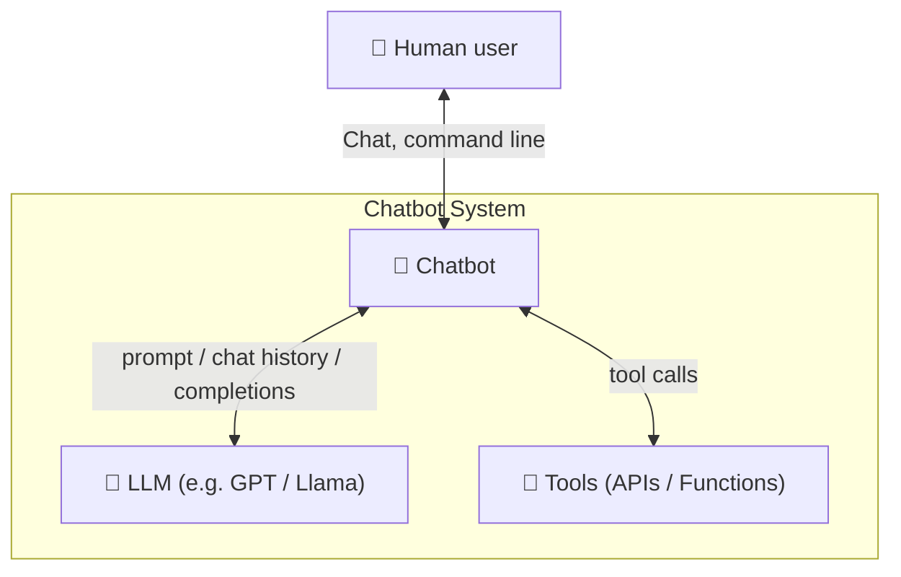
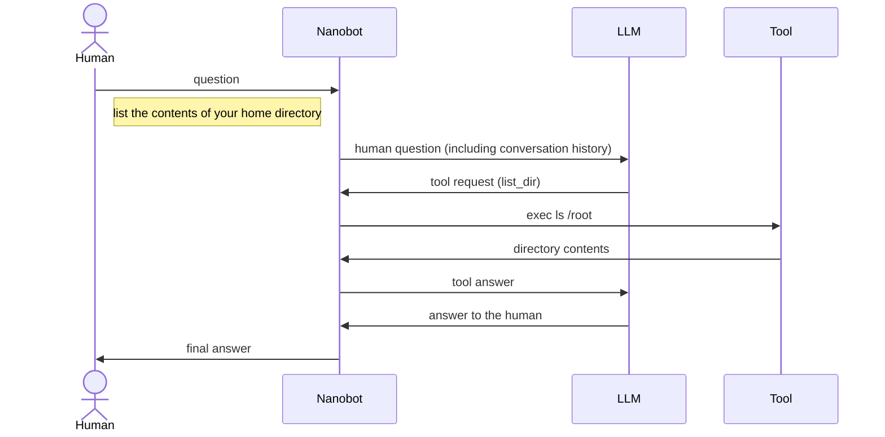

I was chatting with an AI agent about its own configuration,
and it answered with surprising confidence.

Then I thought: wait. How would it even know that?

This post is about what I found when I went looking.

[Nanobot](https://github.com/HKUDS/nanobot)
is a deliberately simpler version of [OpenClaw](https://openclaw.ai).

If you haven't heard about it, OpenClaw is an AI agent running on your behalf 24/7, potentially having all your credentials.
This is possibly the piece of software with the steepest adoption curve of all time, it got to over 1 million active users in 1 week.
Potentially it is also one of the biggest IT security dramas of all time.
Because the more powerful they are, the more risky they become.

Nanobot has similar potential, but with only 1% of the source code of its bigger brother, it is a lot easier to understand.

AI agents have a lot of potential for my work, but I am also interested in the security implications.

(Side note:
I set out to improve the security of its deployment, for example by making it run in Docker.
Not too hard, and my [pull request](https://github.com/HKUDS/nanobot/pull/18) was accepted.)

Playing around with it, I had some questions on the configuration.
I could not resist the temptation to ask nanobot about this.

Can we use agents to reason about agents, in particular about *themselves*?

When I ask it about its own configuration, it gives surprisingly coherent
answers.
Ask about its home directory, it knows. Ask about scheduled jobs, it can tell you.
Ask how its scheduling works, well, that's where things got interesting.

At first, I thought: Wow, this thing actually understands itself.
Then I
caught myself. Wait. How would it even...?

That question kept me up. So I decided to find out how nanobot creates the illusion that it knows itself.
And where and how that illusion breaks down.
This matters for its usefulness, and for its security.

So where does it get that (incomplete) information from?
The foundational models wouldn't yet have specific training data about nanobot's implementation,
although they can infer how scheduling likely works based on general knowledge of similar systems.
So, it probably figures out the specific details from its system prompt and its tooling.
Both are also **attack vectors**.
These are sources of information and instruction, and if they can be manipulated, this will allow control over the chatbot.

To put it in AI slang, how self-aware is nanobot?
AI philosophers and pundits love to see self awareness as a prerequisite for intelligence.
And a lot of people talk about bots in human terms with phrases like 'it knows', or 'it wants to'.
This 'anthropomorphization' of computers is decades old, I even discussed it in a paper I wrote in college, but it seems AI bots bring it to a new level.

We don't just talk *about* bots as if they have human traits, we talk *with* the bots about themselves.

For example, we can ask the bot

- In which timezone are your jobs scheduled?
- What are the jobs that you have scheduled?
- Tell me about your inner workings.

## But where does self-awareness come from?

To answer that, we first need to peel open the bot.

Any AI chatbot has an LLM (Large Language Model) inside.
But the LLM is just an autocompletion machine.
It has no memory or tools of its own.

The chatbot around the LLM keeps track of the conversation history, the 'system prompt',
and any tools that can be used in answering the question.
This system prompt contains a lot of information and instructions that are relevant to the specific use case.
We'll see how that plays out in nanobot.
But first, a [deployment diagram](https://digitalinfrastructures.nl/book/diginfra/deployment-diagrams/) that shows how these pieces fit together.
As with all IT systems, there are boxes inside that send data to each other.

The diagram aims to illustrate the boundaries between the boxes, and the information that flows across those boundaries.



To maintain the illusion of a conversation, the chatbot feeds the LLM not just the latest human input,
but also a lot of the history of the conversation, including the system prompt,
in *every* call to the LLM.
(This is called the context window of the LLM.)

All the turns in the conversation are labelled with a role, e.g. 'system, 'user', 'assistant'.
The LLM is trained to understand those roles.

An important feature is the ability to call 'tools' or commands outside the LLM.
The LLM is told what tools are available, but it cannot call them directly, the bot has to do that.
In answering a question, the LLM suggests the bot what commands to run on the bot host.

The bot then runs those commands, and returns the results in the next conversation step to the LLM.
The human user does not see the details of this step.

Instead it is a step in the conversation history that has role 'tool'.

The output of the tool command is thus fed into the LLM.
Based on the command output, the LLM decides the next step.

To dive deeper into this part of the conversation, we want to trace the input and output of the LLM calls.
As my nanobot is using OpenRouter for access to various models,
I can instrument OpenRouter to log the exact details of the LLM calls to services such as LangFuse and LangSmith,
which have dashboards to drill down into the details.

Both these tools show the literal input and output of the LLMs as they are called.

## Example session - a deep dive

Here is a sample of a nanobot session:

```text
You: list the contents of your home directory

🐈 Here are the contents of my home directory (`/root`):

| Type | Name |
|------|------|
| 📁 | .nanobot |
| 📁 | .npm |
| 📄 | .bashrc |
| 📄 | .profile |
| 📄 | .wget-hsts |

The `.nanobot` directory is where my workspace lives (memory files, skills, etc.). The
others are standard Linux config files. Would you like me to explore any of these 
further?
```

Sounds straightforward, but how does nanobot figure out what its home directory is in the first place,
and where does the directory information come from?

Let's first have a look at the actual interaction for calling the tool, as reported by LangFuse.
(If you want to replay this, in LangFuse go to the Tracing tab, and click on the 'completion' under output.
It will show you a fairly readable version of the following.)

I have left out most of the history of the conversation, including the system prompt (we'll get to it later).
With the # sign I have included some comments.

```json
# The history of the conversation has a lot of interactions, 
# including the system prompt.

# The human user's request results in this step in the history.
{
    "role": "user",
    "content": "list the contents of your home directory"
},

# Next is the response of the LLM
# (which calls itself assistant) 
# it now replies that a tool should be called.
{
    "role": "assistant",
    "content": "",
    "tool_calls": [
        {
            "id": "toolu_bdrk_01EhKybH3T6ehQFTn7gAX4CP",
            "type": "function",
            "function": {
                "name": "list_dir",
                "arguments": "{\"path\": \"/root\"}"
            }
        }
    ]
},

# Nanobot has now added a 'tool' output message to the conversation.
{
    "role": "tool",
    "tool_call_id": "toolu_bdrk_01EhKybH3T6ehQFTn7gAX4CP",
    "name": "list_dir",
    "content": "📄 .bashrc\n📁 .nanobot\n📁 .npm\n📄 .profile\n📄 .wget-hsts"
},

# With all this information assembled in the conversation, the LLM 
# will now produce an output to the human.
{
    "role": "assistant",
    "content": "Here are the contents of my home directory (`/root`):\n\n| Type | Name |\n|------|------|\n| \ud83d\udcc1 | ...",
}
# I have truncated the content here, as it is given above in full. 
```

### The flow of messages

To put it in a [time sequence diagram](https://digitalinfrastructures.nl/book/diginfra/elements-of-digitalinfrastructures/#top):



That is a lot of back and forth, and as you can see the LLM interprets some of the tool output to be more explanatory to the human.

The LLM is also deciding that what the proper tool call is.
For example, it decides to:

- use the `list_dir` tool,
- with the argument `/root`.

That means that the LLM knows that `/root` is the home directory.
But how?

This must be through the system prompt.
In nanobot, the system prompt is composed from a number of configuration files, memory files, as well as some hard-coded strings in the code.
All of this happens in file `agent/context.py`.

And indeed, the system prompt contains this text:

```text
Your workspace is at: /root/.nanobot/workspace
```

The LLM then probably deduces from this that `/root` is the home directory.
But is that introspection, or is it the way Linux systems are typically organized?
This matters because it relates to how we can engineer this introspection.

I got intrigued by that, and decided to try out some more 'introspection'.

## API keys, or, what nanobot does not know about itself

I asked for its API keys.
Here it is getting interesting.

>🐈 I don't have access to my own API key. The API key used to connect to the LLM (like
Anthropic's Claude) is handled by the nanobot application layer that runs me - it's
not exposed in my system prompt or environment for security reasons.

But, the file `config.json` has API keys for the various LLM providers.
These will *not* appear in the system prompt.
This sounds good from a security perspective, but are we sure that there is no way the bot can access them?

Interestingly, asking for `the content of /root/.nanobot/config.json` shows that it can read that file,
though it redacts the actual API key, and warns to not share it(!).

But if I ask specifically for the API key, it will just hand it out.

So it knows its API keys, but does not know that it knows them.
Nevertheless, this is a security risk.
If a threat actor can manipulate the prompt, it can get the API key.

It would be great to try that out, but that probably has to wait for another blog post.

It should be possible to restrict access to that part of the bot's filesystem.
That would be an architectural solution to this risk.

This API example shows how the bot can be wrong about what it knows.
But it gets worse, it can also be just plain inconsistent.

# Timezone confusions

>1. you — 5:48 PM
>what time is it now?
>2. nanobotAPP — 5:48 PM
>It's 2026-02-14 10:48 (Asia/Vientiane — Laos local time, Saturday).
>3. you — 5:49 PM
>what time does your host think it is?
>4. nanobotAPP — 5:49 PM
>I checked the host system clock.
>It reports:
>
>Local: 2026-02-14 10:49:10 +0000 (UTC)
>
>UTC: 2026-02-14 10:49:10 +0000 (UTC)
>
>The host's local timezone is set to UTC (+00:00).

The bot has two sources of self-knowledge that contradict each other,
and both are confidently presented as true.
The first time is a time stated in the system prompt, where no timezone is added, though the bot was told we are in the Vientiane timezone (7 hours ahead of UTC).
The second one is retrieved through a tool call.

It does not notice the contradiction.
Neither would you, unless you ask.

After I finished writing the blog, this timezone bug was fixed.
Which goes to show that this type of investigation is not just philosophical,
it also finds real bugs.

## Wrap up

I started out wondering how a bot could possibly know itself.
What I found was more interesting than I expected — and more
worrying.

Does the bot have self awareness?
I am not into answering that philosophical question.

But we can architect, to some extent, the illusion of self awareness.
As architects of AI bots we have some opportunity in designing how much a bot 'knows' about itself.
More knowledge is probably more powerful, but also more risky.
For example, in the current version (feb 2026) it will spill API keys, but architecture can fix that.

The conclusion is now that the bot brings the illusion of knowing itself through a variety of sources and features.
There is general knowledge about its environment (e.g. Linux), the system prompt, what tools tell it, and so on.

The user might think they are talking to an 'intelligence', but it is the result of a few basic things:

- the configuration it was given,
- results from running tools,
- general knowledge from training.

When these run out, it resorts to confident guesswork,
and that is where it gets particularly dangerous.

Self-awareness is an illusion that breaks down easily,
and the cracks are exactly where an attacker gets in.

Therefore, the question that keeps me up: in your organization, who is actually responsible for what an AI agent knows about itself?
The architect who builds it?
The security officer who has it audited? Or is it nobody? And then, what happens?

P.s. I had an AI create a [6 page infographic from this blog post](https://digitalinfrastructures.nl/agentawareness/page1).
While it gets some of the points off a bit, I did like the visual.