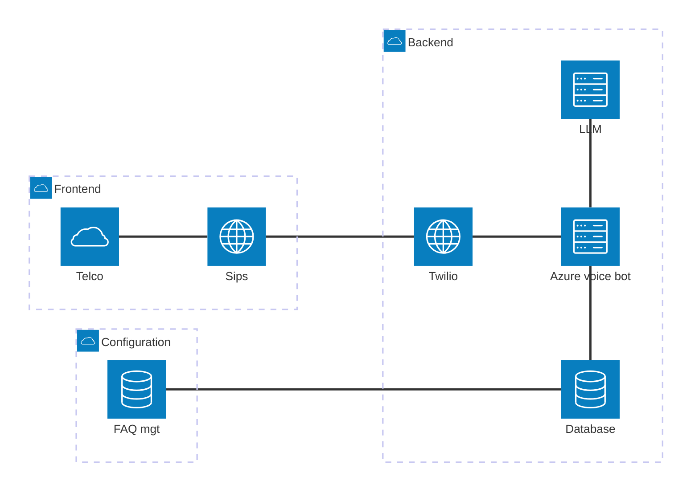

```mermaid
architecture-beta
    group frontend(cloud)[Frontend]
        service telco(cloud)[Telco] in frontend
        service sips(internet)[Sips] in frontend
    
    group backend(cloud)[Backend]
        service app_server(server)[Azure voice bot] in backend
        service twilio(internet)[Twilio] in backend
        service database(database)[Database] in backend
        service llm(server)[LLM] in backend


    group configuration(cloud)[Configuration]
        service faq(database)[FAQ mgt]    in configuration
    
    telco:R -- L:sips
    sips:R -- L:twilio
    twilio:R -- L:app_server
    app_server:B -- T:database
    llm:B -- T:app_server
    faq:R -- L:database


```
