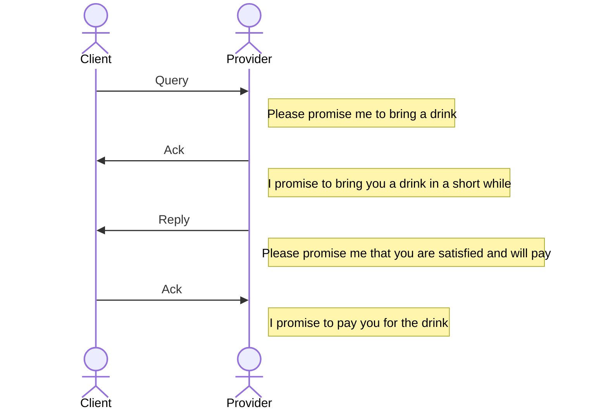
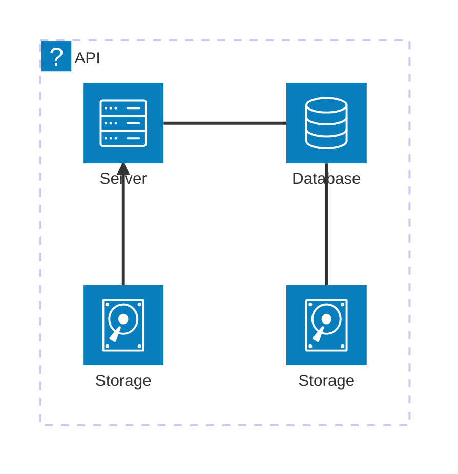
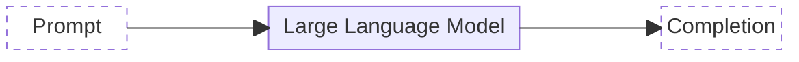

A diagram should automagically appear here.

```mermaid
sequenceDiagram
    actor Client
    actor Provider
    Client->>Provider: Query
    Note right of Provider: Please promise me to bring a drink
    Provider->>Client: Ack
    Note right of Provider: I promise to bring you a drink in a short while
    Provider->>Client: Reply
    Note right of Provider: Please promise me that you are satisfied and will pay
    Client->>Provider: Ack
    Note right of Provider: I promise to pay you for the drink
```

```mermaid
%%  icons from https://iconify.design
architecture-beta
    group api(Storage)[API]

    service db(database)[Database] in api
    service disk1(disk)[Storage] in api
    service disk2(disk)[Storage] in api
    service server(server)[Server] in api

    db:L -- R:server
    disk1:T --> B:server
    disk2:T -- B:db

```

```mermaid
block-beta

in space llm:2 space out
in["Prompt"] --> llm["Large Language Model"]
llm--> out["Completion"]

style in fill:#fff,color:#000,line:#000;stroke-width:0px,color:#000,stroke-dasharray: 5 5
style out fill:#fff,color:#000,line:#000;stroke-width:0px,color:#000,stroke-dasharray: 5 5
   
```
