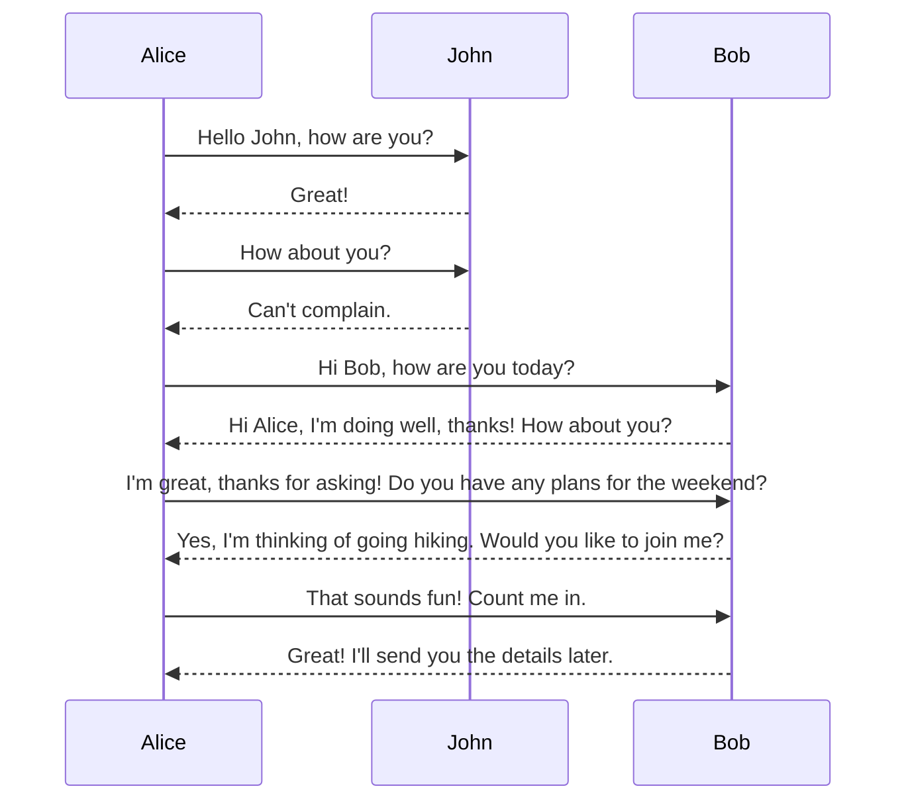

A diagram should automagically appear here.

```mermaid
%%  icons from https://iconify.design
architecture-beta
    group api(Storage)[API]

    service db(database)[Database] in api
    service disk1(disk)[Storage] in api
    service disk2(disk)[Storage] in api
    service server(server)[Server] in api

    db:L -- R:server
    disk1:T --> B:server
    disk2:T -- B:db

```


```mermaid
%%  icons from https://iconify.design
architecture-beta
    group api(logos:aws-lambda)[API]

    service db(logos:aws-aurora)[Database] in api
    service disk1(logos:aws-glacier)[Storage] in api
    service disk2(logos:aws-s3)[Storage] in api
    service server(logos:aws-ec2)[Server] in api

    db:L -- R:server
    disk1:T -- B:server
    disk2:T -- B:db

    group keyvault(logos:aws-secrets-manager)[Key Vault] in api

    service dba(logos:aws-aurora)[Database] in keyvault
    service disk1a(logos:aws-glacier)[Storage] in keyvault

    server:R -- L:storage
```

