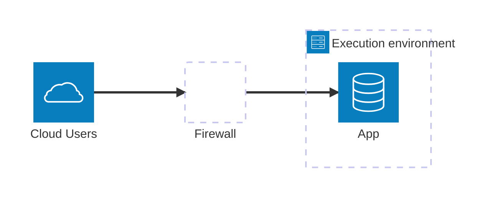
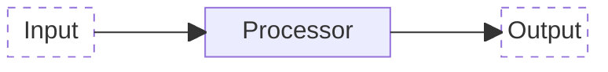
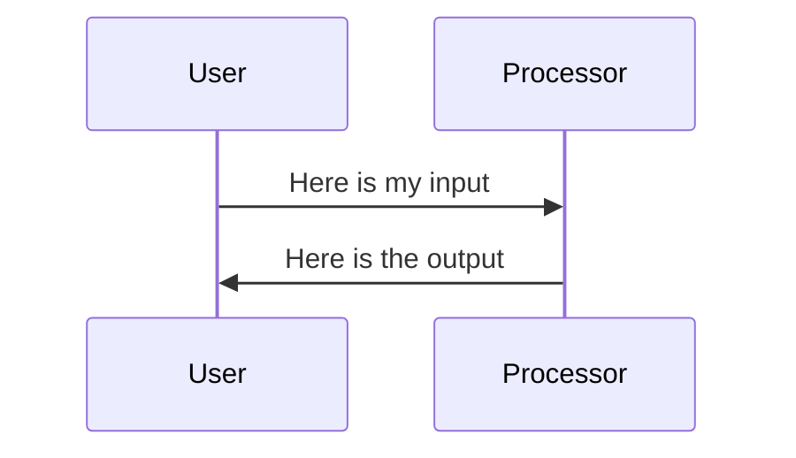

Technologies are often called disruptive.
But what makes a technology truly disruptive?
What has made the PC a disruptive technology? Or artificial intelligence, for that matter?
And at what time did it become a disruptive technology?
While many would accept that AI was a very disruptive technology starting from 2022 onwards,
most of it was available much earlier. GenAI, chatbots, etc.
Think of ELIZA, the 60s era psychology chatbot by Joseph Weizenbaum.

If we understand the mechanics better, we can begin the see how we can predict these shifts better.

Technology power shifts:
In the early 90s I saw the PC revolution come up and shortly afterwords client-server computing, including all the things that went wrong.
A little later, the Internet revolution from boom to bust, and back up again.
Then, early 10s, cloud computing exploded, and I started teaching cloud security.
All of these led to dramatic shifts of power in organizations, and therefore in the way IT was organized. Here I'd like to explore the underlying mechanisms.

While there are many uses of the word 'disruptive' in this context, I'd like to focus on the degree to which a disruptive technology will shift power in organizations and society.

In my professional career I have seen, as mentioned elsewhere, a few major disruptive changes.
Most of these significantly changed power structures.

The mainframe was typically a central corporate strategic decision, necessitating a corporate IT department.
That also implies that conflicts around its use would percolate to the top. This is one of the essentials of corporate governance.

AI has been around for many years, even decades, but its use really took off after the introduction of a democratized tool that everybody could use: chatGPT.

Power dynamics shift when we introduce new actors in the ecosystem.
For example, minicomputers came within reach of department budgets, causing those departments to also start buying them. ChatGPT allowed people to try out GenAI and apply it to their work.

More affordable access to technology introduces new buyers in the game. Freemium business models make that even more accessible. The game is that value from these services is demonstrated with a free proof of concept, which opens the discussion to talk about bigger budgets. It is part of GitLabs official pricing strategy.

---
date: '2025-04-20T09:24:41Z'
draft: false
title: 'Power Flows'
weight: 30
---

Power does not automatically flow from those that have it to those that are influenced by it.

As they say in dutch, quoting the poet Willem Elsschot: "tussen droom en daad staan wetten in de weg, en praktische bezwaren". ("between dream and deed stand laws in the way, and practical objections").

We want to understand this. If we want to exercise power, we need to understand the intermediaries. If we want to subvert power, the intermediaries are one of our disruptive points.

The power intermediary aids in applying power. They are like the forward observer in an artillery unit. They don't have the artillery power themselves, but they definitely influence how it is applied. Knowledge is power, as they say.

And there are many more examples of power intermediaries, and many more words that are used to describe that function. You can think of: power broker, facilitator, mediator, intermediary, but in our digital infrastructures world, we can be more specific.

Let's take an example situation. 
Suppose the board of a company wants to set a digital strategy for the company, who is in the end implementing and realizing that strategy? 
Or, the board wants to demonstrate control over the resilience of the organization to cyber risks. 
In the end, that requires a lot of people and roles, for example in building systems, or doing incident response. Many of these roles are, in fact, power intermediaries, because they facilitate the flow of the board's power to the places in the organization that matter.

As we discuss elsewhere, this involves people, process and technology. 
I also elaborate on two specific positions of power elsewhere: the architect, and the assessor, although they are by no means the only ones. ---
date: '2025-03-22T17:56:28Z'
draft: false
title: 'International Actors'
---

The international arena has many actors that can influence digital infrastructures. But opinions differ on what the important ones are, or even what the relevant ones are.
But the international arena matters, because 
by the nature of scaling, very few digital infrastructures are influenced by a single national actor only.

A word of clarification: I am using the word international here to mean all nations in the world, and their interrelations.
In US vernacular, the word international appears to mean all nations, except the US.
Instead, the word global is used to mean all nations, including the US.

The international arena is complex, and there are conflicting views on how it is made up.
These conflicting views can best be seen as maps of the territory. And as I have mentioned earlier, a map is only relevant for a specific purpose.

The first category of actors is nations, obviously. The word nation is part of the word international.
But we can see many other actors exerting influence, such as multinational corporations, NGOs (non-governmental organizations), treaty organizations, and so on.
Let's break this down a bit.

Nations make laws, multinational corporations make investments and offer products, NGOs such as ISO make standards, treaty organizations such as the EU make more standards and regulations. All of these may impact digital infrastructures.
And sometimes these are conflicting.

Not everybody shares this multifaceted view of the international arena. Some hold that nation states are the only actors that have real power. After all, they control the territory on which people live, and have a monopoly on military force and a legal monopoly on violence.

In this view, nations enable the other types of actors through law and agreements within and between them. Multinational corporations don't really exist in this view. They are constructs enabled by agreements between nations, for example on recognizing property across borders. For example, how is it possible that a national of one country can hold property in another country? This is not universally the case. Many countries do not allow this, at least not unlimited.

A multinational corporation, even if it has public shareholders across the globe, has a primary residence somewhere. And the legal options and obligations trickle down from there.

Similarly, NGOs such as ISO (International Standards organizations) and the International Criminal Court are also established somewhere, and recognized by other countries, or not recognized, as the case may be.

Digital infrastructures don't necessarily map easily to a single organization running them, or even governing them. The internet is a interesting and complicated example. On a day to day basis, internet service is largely provided by telecommunications companies owning the cables and radio base stations. Administering the coordination between these and other providers, is done by many actors. For example the use of IP adresses is coordinated by a non-profit established in the US. But there are many more players in that space, often independent.

In contrast to the multi-nation view of the world is the perspective that what really matters in the international arena are the multinational corporations. They have significant control over the international flow of goods, services and investments. Understand that many of these corporations have annual turnovers that are larger than the gross domestic product of 80% of the world's countries.

Large businesses have the capability to drive government policies. Even US presidents see that. President Eisenhower warned about the military-industrial complex in 1961. President Biden extended that, and warned against the power of the tech industry and AI in particular in his last speech in 2024.

This is not hypothetical. There has been succesful lobbying by US companies against international regulation that is seen as limiting to them.

Many multinational organizations are largely legitimate, but there are quite a few whose main objective is to launder money outside of the control of nations. Beyond that, when it comes to cybersecurity, internationally organised crime has business models that include ransomware extortion and bitcoin mining on hacked computers.

Then there is the perspective that the only really important international actor is the US.
With more than 700 military bases in more than 80 countries, this is the single largest international military presence in the history of mankind. Additionally, since the end of world war II, the US has alledgedly intervened in dozens of countries, through military or other means, three times more than Russia, the next contender.
By the way, these numbers are hard to validate precisely, though the order of magnitude is uncontested.

Beyond this, the US dollar is the currency of reserve for most of the world, and the US stock markets dominate international capital markets.

As a final alternative perspective, it is conceivable that there are people who think China has always been, and will be, the economic superpower of the world, with a brief 200 year interuption which is about to end.

All these actors may exert power over digital infrastructures.
And to confuse matters even more, these actors do not always acknowledge the power, or even the existence, of other actors.
We'll discuss some examples of this elsewhere.
---
title: 'Who made podcasting big?'
date: '2005-09-05T13:35:00'
draft: false
weight: "50" 
---
Podcasting has its own digital infrastructures, for example in hosting them.
Let's look at how podcasting has grown, and what made it take off anyway?
Many actors influence each other here, and the state of the art of the technology also has an impact on growth rates.

Suppose a hundred people get told by an enthusiastic friend to try podcasting.
Of these, ten don’t have any hardware on which they can play the podcasts.
So the rest goes online, and tries to find interesting content, but only 50 people can find a directory in which they can even start to look for podcasts that they like. Only 40 people then find content that they sufficiently like.
Ten people drop out because they find loading the content too complicated. Of these, another ten find out that the files are too big for the hardware they have (for example in 2005, they just had a simple MP3 player, no iPod or similar).
Of the ones left, another five don’t have the patience for the downloads (we are talking dial-up internet access for a lot of people here, still).
If you have been keeping tabs: we are down to 25 people who are capable and willing to regularly listen to podcasts. Now suppose each of these tells four friends, on the average. That means we are back to a hundred.

Now suppose that all those numbers are a little _worse_ than I have guessed. In that case, any enthusiasm will soon sizzle out.
Now suppose that the numbers are just a little _better_, so that at the end of the week we have 110 people that are going to try subscribing to podcasting. The week after, it will be 121 people trying, and so on. This represents a growth rate of 10% per week, which amounts to more than a hundred fold increase in a year (12,913 people to be exact).

In fact, all these numbers have been getting better gradually over many several years.
Both the technology and the content were existing as early as 1997. Yet, the gradual increase took until about 2005 to reach what Malcolm Gladwell calls: “The tipping point”.
This is when a development, epidemic, or trend just seems to explode.
Obviously, technology has improved, in particular once the iPod was launched, which could store 1000 songs. But something more was going on.

I checked these numbers with Adam Curry, who is regarded by many as the father of podcasting, or 'podfather'.
I found out that he has made a conscious effort to improve the numbers. For example, he developed 'ipodder', which started as a piece of software to make the mechanics of subscribing to podcasts and getting them on your player easier. Ipodder was a directory to help people find content that is interesting for them. Curry also ran “The Daily Source Code”, a regular podcast, as a tool for podcast software developers to test their software.

There is also a tipping point for creators of podcasts, which works in tandem with the tipping point for listeners.
But I will leave you to figure out the details of that yourself.

We can't really say that one person had the power to force podcasting upon the world, but there was definitely somebody with the insight and the opportunity.
---
date: '2025-03-09T11:06:48Z'
draft: false
title: 'Positions of Power in IT'
weight: 20
---
One of the key aspirations of Digital Infrastructures at Scale is to equip you with the tools to shape and drive change in your professional environment—especially when your goal is to lead a transformation.

Two important positions of influence in IT are architects and auditors/assessors.

IT architects are builders. They design new applications, platforms, and infrastructures that enable businesses to operate more effectively. A CRM system, for example, is not just a technical solution—it transforms workflows, communication, and decision-making. Similarly, infrastructure architects create digital foundations that accelerate the deployment of such applications.

Auditors and risk assessors, on the other hand, focus on preventing failure. Every technology introduces risks, and without proper attention, these risks can derail progress—whether through security breaches, compliance fines, or operational breakdowns.

Both roles involve power.
Without power, things will not move in the way you want, and every initiative encounters resistance. 
Understanding the sources of power—and the forces that push back—is essential for you to achieve meaningful outcomes.

Money is a form of power, but it is often a blunt instrument. In organizations, other forces—such as survival and strategic priorities—can be even more influential. The key to driving transformation is linking these forces together with precision.

This book provides you with the frameworks, insights, and real-world examples to navigate these challenges and drive successful change.
---
date: '2025-03-09T18:54:24Z'
draft: false
title: 'Power'
weight: "15"
---
---
date: '2025-04-05T12:31:46Z'
draft: false
title: 'Introduction to Power'
weight: 10
---
Power is a concept that is widely used and ill defined. Many philosophers have discussed it, but not one definition really stands out.
Before we attempt to define power formally, let's see how the word in used in everyday IT situations.

Understanding power in IT is not just academic. As the examples show it is crucial in understanding how IT works, and creates value and risk.

1. The cloud architect held significant power in deciding which platforms the organization would adopt for its digital transformation.
1. Automated deployment pipelines gave development teams the power to release software faster and with fewer errors.
1. Legacy systems often retain unexpected power in large organizations, simply because so many critical processes still depend on them.
1. Regulators have the power to halt digital initiatives if data protection requirements are not met.
1. By owning the central identity management service, the security team had the power to control access across the entire infrastructure.
1. Outages at major cloud providers show how concentrated power in digital infrastructures can lead to systemic risk.
1. The CIO used the power of budget approval to steer the enterprise toward adopting more secure infrastructure patterns.
1. Power struggles between central IT and business units can delay the rollout of shared infrastructure services.
1. With real-time observability tools, operations teams gained the power to detect and respond to incidents before users were affected.
1. An open-source community can collectively wield more power than a single vendor when shaping the direction of a software tool.

From these examples, we can see certain recurring features of power in the context of IT and digital infrastructures.

- Power can be attributed to people, technical artifacts, teams, organizations as a whole, roles, and institutions, to name a few.
- These same types of actors can also be the subjects of power.
- Power is exercised through a variety of means and mechanisms.

In these examples, mechanisms include:

- Decision-making authority – The ability to choose platforms, policies, or directions.
- Technical capability and automation – Tools that enable or restrict what actions are possible.
- Dependency and path-dependence – Power held by systems or practices others rely on.
- Legal and regulatory enforcement – Influence through rules, compliance, and consequences.
- Control over chokepoints – Gatekeeping access to critical systems or resources.
- Centralization and concentration of infrastructure – Power from aggregated control or single points of failure.
- Resource and budget control – Steering outcomes through funding and prioritization.
- Organizational politics and influence – Competing agendas, alliances, and negotiation.
- Information asymmetry – Advantage through greater visibility or data access.
- Collective governance and community action – Shared power through participation and collaboration.

These are the building blocks of effective IT.
The way these mechanisms are organised plays a critical role in shaping both the value and the risk of digital infrastructures.

A common thread is that power influences the future, and influences the outcomes of activities.
The simplified definition of power, inspired by Oxford Languages, that I use here is:

> _Power is the ability of an actor to direct or influence the behaviour of others or the course of events._

As our examples show, these actors are not just people - they can include technical artefacts and teams.

Power isn’t just philosophical—it’s operational. It determines what can be built, who gets to decide, and how resilient or risky systems become. To work effectively with digital infrastructure, we need to see power not as abstract, but as architecture.
---
date: '2025-03-22T17:56:43Z'
draft: false
title: 'Systematically applying technology'
weight: 20
---

How to fix the WiFi? How to find a new phone for grandma?

Applying technology follows certain rules. However, many people only have an intuitive understanding of these rules. As a result technology is not optimally applied.
By understanding how applying technology really works, you can be more effective, more efficient, reduce waste, and overall do a better job. It takes just a few simple steps to improve any attempt at applying technology. We'll focus on information technology here, though most principles have wider applicability.

Let's start by looking at a few examples that I have used these in teaching IT students. The first example is fixing the WiFi at home, and the second one is selecting a new mobile phone for grandma. Think for a moment how you would approach these two cases. If you want a more corporate example you can think of replacing a content management system, or introducing a new security capability.

The core idea of technology is that by doing an **intervention** in the real world, you achieve certain desirable outcomes. This is in contrast to the core idea of science, which is that by doing observations on the real world, we can derive certain conclusions that allow us to predict what might happen under similar conditions in the future. Science seeks to understand and explain the underlying principles governing phenomena, while technology applies that understanding to create tools, systems, or processes that achieve specific goals.

Of course, science and technology are intertwined: technology relies on scientific insights to be more effective, while science often needs technology in order to do experiments and observations.

As our ambition is to apply technology in a bit more systematic way, let us begin to ask ourselves what it is that we try to achieve.

By the way: technology literally means the science of technics. In english there is not much of a distinction between the techniques and technology.

A technique aims to achieve a certain desirable outcome. Interestingly enough, the attention is often on the technique, and a little less on the outcome. I find that focussing on the outcome first is a productive and relevant thought exercise.

Let's review our examples. What does fixing the WiFi mean? What result does it achieve? This could be many things. Maybe we want a better internet experience in the back of our garden, or on the top floor? Maybe we want to have higher internet speeds inside the house. Maybe we want less packet loss. Maybe we want to play our games with less ping delay, so we can win more often. Maybe we want to allow our friends easier access, or more security.

The essence of the result is that some measurement of quality improves for some stakeholder.

Turning our attention to grandma's new phone, what do we want to be improved? Maybe her current phone is too hard to navigate because the buttons are too small, or it does not run an app that allows here to see the pictures of her grandchildren. Or maybe it breaks down all the time, and your tech savvy nephew has to come over to fix it, and he does not want to do that as often anymore.

Now we can turn our attention to the intervention. In our WiFi case, are we buying more access points, and if so, where should they go, and how should they be connected? Maybe we want to change the frequency allocations, or allow use of the 5GHz frequency bands. With grandmas phone, do we install new apps, buy a different size phone, or what?

How does the intervention lead to the desired result? In other words: how does one lead to the other? Maybe you have a (scientific) theory about that. Maybe you'll just need to figure it out. In both cases you start with a hypothesis that explains how the intervention leads to a result.

For example: because WiFi signal strength (and therefore quality) decreases with distance between device and base station, we install more base stations in order to have better quality around the house. Another example would be: because there is limited frequency spectrum, we reconfigure our existing base stations to use different frequencies in order for them to interfere less, and have better network quality within their range.

As you can see from this example, your assumptions, your hypotheses, matter.

We can morph these statements in a variety of useful ways. This is what makes for professional application of technology. Here are some variations.

1. By theory Z, we do intervention X to achieve result Y.

1. We hypothesize that intervention X will lead to result Y, in which case we can start to form a theory.

1. How does intervention X lead to desirable outcomes?

1. We are looking to achieve result Y, and we have theory Z. What does that tell us about possible interventions?

Once we grasp this, we can move on to more complicated scenarios. We can flesh out what a better outcome is. We can use this to do design in more complicated situations such as with more stakeholders. We can also use this to do more systematic troubleshooting.

More about that later.
---
date: '2025-04-04T14:20:26Z'
draft: false
title: 'Network Management Automation - the DHCP case'
weight: 40
---
As we mature processes, they come within reach of actual automation. Especially IT management processes. To paraphrase General Carl von Clausewitz, who said "War is the continuation of diplomacy with different means", we can say that automation is the progression of process maturity with different means - replacing human effort with software and systems.

My favorite historical example is IP address allocation. In the past, whenever there was a new computer, you would walk up to the head of the lab or data center and ask for a new IP address for that machine. You may remember that.

You'd go to the person in charge for an IP address, they'd pull out their notebook, sharpen their pencil, and note it down. Simple, manual, and not built for scale.

In 1994 I went to a Unix systems administration conference and they had Mike O'Dell over from the USA.
He had a [presentation about the internet](https://archief-website.nluug.nl/activiteiten/events/vj94/abstracts/Mike.ODell.html) where he talked about many layers of technology to just push IP packets around. I was impressed by the number of layers back then, but I think what he was trying to say was how wasteful it really was, and that many of these things had to be reengineered to allow the internet to grow.

As a side note, it grew by a factor of 500-1000 in number of users in the thirty years since. At the time of the conference there were about a 1000 websites worldwide, and this conference is the first one listed on the NLUUG website.

We talked with him in the bar afterwards, where he said: "You know, next year Microsoft's going to come out with a new version of Windows (editor note: Windows 95) and that will have an internet protocol stack built in to the operating system. They're planning to sell 150,000 of those every month". That sounded like a staggering amount.
Can you imagine how many IP addresses that will be right? How are we going to manage these? We need more pencils!

Then he mentioned that Microsoft collaborated with the IETF to define an automated system for IP address allocation. That standard we now know as DHCP, and it is also in every PC and practically every network. It very likely has reduced many errors that happened in the traditional process, such as duplicate IP addresses being handed out.

What we see here is that a process (address allocation) matured enough for it to be automated. Consequently, it can scale up, and it can be of higher quality.

Another perspective on this is that this activity largely fades into the background of the system administration domain, and becomes part of the technical digital infrastructure. This is a very common pattern in IT, systems administration, and in digital infrastructures in particular.

Compare how assemblers and compilers were heralded in the early days of writing software as making programmers redundant. Well, automation did not make them redundant, it just made them write software on a much higher level of abstraction, leading to more productivity and more quality. The same thing happens in systems administration: as parts get automated, admins operate at a higher level.

In the late eighties, a university colleague of mine, now a retired professor, was doing his PhD on network management architectures—a concept that was quite elusive at the time. What did network management entail? How would it be standardized? Back then, the idea of computer networks was still new, and automating their management seemed unnecessary because there were so few computers. However, once networks started to scale, network management became much more critical.

His research focused on SNMP and similar technologies. Just as DHCP automated address allocation, SNMP helped manage network measurements and settings. Ultimately though, he concluded that network management encompasses everything not yet automated into a protocol. Again, this represents a maturity story: human management handles what we cannot automate (yet).

That is the cycle of digital development: from manual effort to mature processes to automation—and then on to the next layer of complexity.
---
date: '2025-04-08T09:17:02Z'
draft: false
title: 'Introduction to Change and Control'
weight: 10
---

Change is quite inherent in technology, and in particular in information technology.
At the same time we want technology to provide a reliable service, and that requires a degree of control.
In this chapter we'll explore some fundamentals of change, in particular how this works with groups of people.

Change and control mindsets complement each other.
We need both, even if they conflict at times.

For example, in a typical IT environment, you have developers and system administrators.
The output of the developers is a stream of changes: new features, improvements, bug fixes, and so on.
Adminstrators are in the business of keeping everything stable, the same.
They see no fundamental difference between a new feature and an incident. Both are disrupting the normal flow of business. Consequently, they are seen as a threat, and that is why it often feels that developers and system administrators are from different planets.

Part of running a smooth IT function is juggling the balance between change and control.
---
date: '2025-04-19T20:01:07Z'
draft: false
title: 'Control Through Feedback Loops'
weight: 12
---

There are many ways to influence and control a system, but one of the most controlled (pun intended) ways is to use feedback loops.

Let's start with an analogy first: driving a car.

If you want the car to stop as fast as possible, it suffices to push the brakes as hard as you can. But that does not give you much control.
For example, your passengers might not like it, and it leads to wear on the tires.
If you want the car to stop at an intended location, for example just in front of a traffic light, you apply a feedback loop. 

Another example is keeping the car in the proper lane on the road.
Such a loop starts by observing the state: where are we driving? Then we figure out how that differs from the middle of the lane, which is presumably where we want to be driving. Based on that difference (the error) we turn the steering wheel. That is the control we apply. The car will respond, after which we can observe a new state. This closes the loop.
We feed back information from observing the car into the control.

Cars are full of feedback loops. Some are mechanical, some automatic, some have a human in the loop. And some exist outside the car, such as traffic control systems.

We typically want the feedback loops to keep (or bring) the system in a specific state.
In our car example: we want the car to be driving nicely along the highway. 

For the feedback loop to lead to this result the feedback should be negative, meaning that deviations from the desired state are counter acted, instead of amplified.

There is a lot of theory on these types of control systems, for example to figure out if they work fast enough at an acceptable cost.

Let's look at some examples of feedback loops in digital infrastructures.

Large websites have so-called autoscalers. If the load on the website increases, for instance because the website is suddenly in the news, or it is Black Friday on a shopping site, the autoscaler can spin up more webservers to handle that load. 
It acts by observing the webtraffic and the delays in handling that, and controls the amount of servers that are active. 

In the early days of the internet, I advised a retail internet service provider.
At the time, those were independent companies, not part of the telecommunication companies. 
They were growing very rapidly, and as a result they experienced quality issues.
Consumers found that web downloads were too slow, and threatened to leave. 
The cause of this was that the company was not adapting its connection to the internet fast enough. 
That connection was a large part of the cost of running the provider, so they did not want to buy too much too early.
To fix this, I created a control rule through which they could better balance between spending too much on bandwidth and disappointing consumers. 

Feedback also make AI deep learning systems work. The neural network is given a series of training data. The output is checked for correctness, and on the basis of the errors, the weights in the network are adjusted. Repeat this long enough on enough processors, and the errors will drop. The network has then learned.

Feedback loops are everywhere. 
- When you download a large file from a server, the server will adjust its sending rate to whatever the network and the receiver can handle. 
- When a cloud provider gets more customers, it will adjust the server capacity it has, and it will also adapt the staffing of its support center.
- In cybersecurity, we observe the patching level of software components against known vulnerabilities, and update the software as needed.

Understanding feedback loops helps you understand how control can be applied.---
date: '2025-04-07T22:04:09Z'
draft: false
title: 'Change and control'
weight: 25
---
---
title: Why lawyers need to understand cloud
date: '2018-05-03T13:54:48'
draft: false
weight: 40
---

Cloud is too important to leave to technical people.

Cloud distributes responsibility for IT services across an IT supply chain. This supply chain is composed of independent providers. This implies that there are these companies have **technical boundaries** that are matched by organizational and **contractual boundaries**. This is new, we did not have that before the digital revolution.
Amazon calls this the **shared** responsibility model for cloud security.
I would simplify that as:  _what do I do, and what do you do_? For example, who is responsible for patching the Operating System in an IaaS service model?

Contracts need to fix this allocation of responsibilities, otherwise it is not enforceable. But, who is going to check those contracts? Who needs to make sure that the contracts actually specify those tasks, specify who needs to do them, and specifies how to monitor and enforce that. That is a job for procurement and legal, typically.
Because of that, these people (in this case: procurement and legal) need to understand what the service is. And they need to understand which (technical) tasks are not part of that service.

This is important. Insufficient understanding delays the whole assessment process, and reduces its quality. As one of my course participants, a legal person, once said:

> “ _When I go into a conversation with a cloud provider I have time for let’s say 10 questions. If all these questions go to understanding basic cloud terminology and technology, I have missed the opportunity to talk about the real risk and opportunity for our company_ ”.

The conclusion must be obvious. Educate your lawyers, procurement and so on. Help them understand the cloud well enough. Help them know where technical boundaries need to be translated into legal controls.
---
date: '2025-03-09T18:53:44Z'
draft: false
title: 'Introduction'
weight: "2"
---
The internet is a _digital infrastructure at scale_. Let’s unpack that for a moment.

It is _digital_, because it moves bits between devices.

It is _at scale_, because it moves these bits between billions of devices ranging from websites to mobile phones to robot lawn mowers. (how many?) That is impressive technology, but what keeps that together is the _infrastructure_ part of it. That is what defines the relation between the consumers and the providers, and that is what we are exploring here, as I will show you later.

Looking at it through the lens of infrastructures allows us to understand use cases, abuse cases, and how to define, build and manage things like the internet.

These digital infrastructures are everywhere, and they are important tools to create value and power. But at the same time, even because of this, they can also be great sources of risk.

Better understanding digital infrastructures at scale allows us to better navigate the digital world at large.

So, what are some of the characteristics of infrastructures? What is it that I am calling a digital infrastructure?

We are taking the internet as an example of a digital infrastructure because most people are familiar with it.

Social media is another example, and one that uses the internet as a component. Similarly digital marketplaces are an example.
In the same way, the internet is also built on many other infrastructures: telecommunications, DNS, Number authorities.
In the realm of IT management, there are many more examples of shared services.
Because there are so many examples of digital infrastructures, it makes sense to explore the commonalities. That will make it a lot easier to create, analyze, control, and manage them.

How do the examples that I have mentioned deliver value to their users and other stakeholders? What are the mechanisms and principles in there? If we know a bit more about that, we could better engineer that value and the way it is delivered.

What are the power structures around digital infrastructures? Who are the stakeholders that influence them, or are influenced by them? This cuts both ways: it brings value and risk to the table. Stakeholders typically want to increase value and reduce risk to them. But interests may also be conflicting, and resources are never infinite. With more understanding of these power structures, we have another handle on value creation and risk reduction.

What are the risks associated with digital infrastructures, and what are the ways to organize our management of them? Obviously, there is a vast body of knowledge around that, for example in the space of cloud computing, and to an extent also around artificial intelligence. I am not going to treat all of that, instead I want to bring out some core principles that have helped me, my clients, and my students to navigate that.

I think this story is of interest to many senior roles in IT and business. I have worked with consultants, policymakers, researchers, risk assessors, IT architects, digital business owners, students, teachers and other scholars. Giving these people some tools to use for their work would be gratifying.

I don’t have final answers to all the questions that I can pose, and I cannot afford to wait until I have them. For that reason, I want to present the book as an ongoing project, for the time being, where I organize my thoughts and research in the form of blog posts, that at some point will be assimilated in the draft book.

This is hardly a book on digital technology, but more on the organizational and societal impact of managing this at scale.

For a better understanding of digital technology I highly recommend Brian Kernighan’s [“Understanding the Digital World”](https://kernighan.com). And if you want to have fun while learning how to understand software, I’d highly recommend [“The Nature of Code”](https://natureofcode.com) by Daniel Schiffman.

As you will find out in this book, I am putting on some very specific lenses to look at the world. You may find them restrictive; you may find them arbitrary, you may find them opiniated. Yes, this specific way of looking at the effects of digital technology has its limits. However, the essence of understanding is to be able to extract the core elements out of something. Paradoxically, only by restricting the way we look at things can we see more clearly. Cut through the noise. Like Goethe said: “In der Beschränkung zeigt sich erst der Meister”, though he applied that to a different subject.

I have a very limited perspective of the world. There are so many things and concepts that I just fail to remember or understand.
And yet, that limitation has served me well. It has allowed me to focus on core principles that you may not see if you take in all the richness and idiosyncrasies.
My limited perspective can serve you as a map. And you know that every map is not equal to the terrain it covers. In fact, the purpose of the map is to extract only the most relevant features of the terrain. How good a map is, judgement on the quality of the map is not objective. It is dependent on what you use the map for. A railroad map is close to useless if you navigate by car or boat.
That is why you should consider the models and the perspectives that I give you as maps to guide your journey. If they bring you where you want to be, great! If not, get a different map.

As you will see, the core elements of the models I find useful revolve around interactions between autonomous agents that process information. These agents typically have limited (bounded) capabilities.
This is similar to how maps are a means to reduce attention requirements. These agents can be humans, software or AI agents.

As I believe that you are an autonomous agent as well, it is up to you to decide how useful these models and stories are for your practice. You will not find answers to every question that you have around digital infrastructures. Where possible and relevant I will point you to other views, stories and explanations. At the same time, you may find my maps to be also useful for domains that are outside the digital.
---
date: '2025-03-02T22:00:32Z'
draft: false
title: 'Preface'
---

This book has been more than thirty years in the making.
The two main reasons for that, as I look back on that now, are that the field of Information Technology has been developing incredibly rapidly, and that I did not see the opportunity within my business to create a focus for which writing a book would make business sense. And if I did, the focus never seemed to last very long.

Instead I wrote smaller pieces from time to time, as well as lots of educational materials, triggered by a need from my learners.

I did try to create a larger, organised collection of knowledge, and even had a basic taxonomy in place and raw input. But the dynamics of my professional life continuously outran my plans to turn it into a book.

I have occupied myself with IT for over half a century now, arguably most of that in a professional capacity. For a substantial part of that time, I have been searching for some focus. It took me until the turn of the millennium to finally get an expression of that in the form of a professional branding statement. It was an interesting process to come up with the following.

> _Peter van Eijk is an innovative ICT strategist who makes connections between business, people and technology. With wit and confrontation he guides you to new approaches. He is inimitably hard core Internet oriented, yet never forgets that communication is between people, not machines._

That message has served me well for a long time. And in fact it was the basis for the name of the business I set up in 2005: "Digital Infrastructures".
I would like to think that I made up that phrase, because it has taken up a life on its own on a much larger scale, but in 2005 there was already a small IT company serving the local dentists in Oregon by that name. Still, I am fairly confident that through my former colleagues its use has accelerated.

Nevertheless, "Digital Infrastructures" is too broad a concept to serve as the title for an attractive book. "Cloud Computing" was a term with much wider appeal, and it has served me well. Around 2010, my business pivoted to cloud security training, which I have delivered in many countries over many years to many people.

Cloud computing resonates with me, because it blends technology with business, and you need to understand both in order to truly understand its risks and benefits. I loved bringing this to professionals of all levels of experience. I even took a side job as Associate Professor of Cyber Security and Cloud at the Hogeschool Utrecht to bring it to the next generation. If one thing, that position greatly helped to develop my thinking on how to educate people in professional IT skills.

But all good things come to an end.

Technology develops in waves, is never stable, and cloud computing is now mainstream. I feel that this is one of the causes of the demise of my training business, which happened during and after the covid-19 pandemic.

At the same time, this adoption of more IT in general, and more cloud computing in particular, in businesses worldwide has raised the stakes. IT is becoming essential to many businesses. Marc Andreesen's 2011 essay "Why software is eating the world" already outlined why many businesses are effectively IT and software businesses. A decade later this has only become more true. And current day geopolitical tensions are spilling over to the digital domain in many different ways. There is no lack of importance in being able to navigate this space.

How to make sense of this, and how to position myself in a new and helpful way then became my question of urgence.
Obviously, understanding of technology and business has an important role in this, but it started to become more and more clear to me that power dynamics are another important key to mapping the development of IT, its value, and its risks.

The idea of more writing came back.

No longer constrained by my focus on cloud security, I felt liberated to review some of the earlier writing I had done in this light. I also allowed myself to let go of aiming for the 'final answer', and instead see writing as a tool to understanding. "Writing to Learn" by William Zinsser was inspirational for that. And AI chatbots turned out to be a good tool for externalizing my inner critic, so it no longer interfered so much with getting all these ideas out of my head, and into the public light.

Still, I don't see this book finished soon. At the same time, I am working to make every draft useful to its intended audience.

For decades people have trusted me to help them and their teams be more successful in their handling of IT. In these writings I try to open up my mental toolbox for that.
Scientific rigor isn't my main objective, though I try to make clear what my assumptions are. I am more a conceptual pragmaticist. Can we make something that works and is useful, and do so by applying some universal truths? I also strive to make that set of concepts simple and powerful.
I am assuming that you will find that toolbox very relevant in your role, and that you may not have had a formal education in any of the areas that I outlined above. In the introduction of the book you'll find more elaboration of that.

I sure hope you find it useful.

My thanks go to many people. Professionally, my clients, learners, colleagues, readers, and even chance encounters at conferences, have taught me so much by providing me with insights, inspiration and criticism (even if it hurt). It goes to show that, contrary to what many people believe, technology is a teamsport.

I am grateful that you have come so far in reading this already, and the opportunity to share my experiences, and look forward to helping you uncover new ways of navigating the complexities of the digital age. I sincerely hope that you will find benefit in this.

Thanks for joining me.
---
date: '2025-03-09T16:51:04Z'
draft: false
title: 'Preface'
weight: "1"
---

Lorem ipsum preface
---
title: Business Model Canvas for SaaS Providers
date: '2014-12-15T11:18:17'
draft: "false"
weight: 50
---

Here is a high level overview of the SaaS provider business model and some of the strategic options that are in there.

## Business Model Canvas

The Business Model Canvas is a strategic management tool that serves as a visual framework for developing and discussing business models. To learn more, visit [Wikipedia](http://en.wikipedia.org/wiki/Business_Model_Canvas) or the [Business Model Generation](http://www.businessmodelgeneration.com/) website.

The Business Model Canvas is composed of nine essential building blocks, which define the interconnections and relationships within a business model. In this article, we'll explore examples using two hypothetical SaaS providers: one offering bookkeeping software and the other a project collaboration platform.

## Customer segments (CS)

In the Business Model Canvas, “Customer Segments” are the groups of customers that the company ultimately serves, I.e. the ones that consume and pay for the services.

It is characteristic of the SaaS model that this could basically be anybody, not just IT people. Let us just remind ourselves that customers here are the ones that use the service to get their business done, or get their personal lives in order. In a business context we often also have to distinguish between the user and the organization that purchases the solution. This is very likely true in the case of our bookkeeping software company.

## Value Propositions (VP)

Value propositions reflect the customer problems and needs. This is the central element that describes why the customer would ultimately pay for the product or service.

The essential characteristics of cloud computing may or may not relate directly to the core value proposition of the software application. In our first example, the core value proposition —automated bookkeeping— is unrelated to cloud computing. Of course cloud computing’s characteristics give the SaaS proposition an edge above its direct on-premises alternatives even if the functionality would be the same. Self-service provisioning leads to quicker time to deploy, more scalability in usage (whether accounts or transactions), lower investments or commitments, and potentially lower cost.
The value proposition is fundamentally different in the second example, the project collaboration support site. In this example, the cloud's characteristic of broad network accessibility directly enhances the software's usefulness for users spanning company boundaries.
Interestingly, the first provider could use this insight to extend its functionality beyond what would be possible in an on-premises solution. Think collaboration with accountants, suppliers and possibly customers, or channel partners.

## Channels (CH)

Value propositions are delivered to customers through communications, distribution and sales channels.

It is often assumed that cloud computing relies solely on self-service direct sales, but the reality is much more diverse. SaaS providers in particular are developing extensive partner programs.
The typical enterprise software solution is not implemented overnight. It takes attention to change management and alignment on master data for example. That is why system integrators often experience the move from on-premis to SaaS as relatively painless. They are doing the same job on a different environment.
Less invasive SaaS offerings are frequently aggregated in broker portals, commonly referred to as 'enterprise app stores.' These portals add value through consolidated billing, self-service provisioning, identity management, and potentially some data integration. But that is one to paint on another business model canvas.

Another natural extension of the SaaS model is exposing the core functionality through an API. While not directly accessed by the consumer, this does allow integration with other SaaS providers. Our project collaboration software could integrate with an existing cloud storage provider.
The main SaaS channels therefore are direct self-service sales, value added re-sellers, system integrators, and enterprise app-stores. The notion of cloud broker fits in here as well, but dissecting its many shapes and forms is a topic beyond the scope of this section.

## Customer Relationships (CR)

Customer relations are established and maintained with each specific customer segment.

The lure of cloud computing is that the provider can have a much more direct relation with the customer than is possible with an on-premis solution. Technically, the provider can potentially see each and every move from the users. Which software builder would not like to be able to see the popularity of every feature in real-time? This allows for much more rapid innovation cycles.

It is not impossible for the loop from idea to wide customer feedback to be closed in a couple of hours.
However, this power can bring the provider in conflict with the consumer who might object to its data being used. As an example that is close to the limit of what might be considered acceptable consider the following case. An on-line bookkeeping service for individuals allows them to categorize payments to merchants. Once enough individuals categorized Danny’s steakhouse as a restaurant, this can then also be suggested to other clients of Danny’s. Is it legal to use data from one cloud consumer to deliver value to another? Generally speaking, the answer is no, but it may be acceptable if only aggregate data is used.
Support is often easier on-line, and on-line communities often add considerable value for the consumer.

## Revenue Streams (RS)

Revenue streams are the result of value propositions that are successfully offered to customers.

The structure of revenue streams is where cloud computing differs from earlier IT service models. Software firms traditionally relied on licensing arrangements that were somewhat usage based, and could be hard to enforce technically as well as legally.

Cloud computing service models by definition are usage based, and have the potential to be much more closely related to the value that is experienced by the customers. Both our examples enhance the productivity of users, and it is natural to charge per user who has access to the functionality on daily basis. Transactional services such as event management or email delivery are more naturally charged by the transaction, potentially on a bulk basis.

## Key Resources (KR)

Key resources are the assets required to offer and deliver the previously mentioned elements (e.g. value proposition, customer relationships).

The core asset of a software company is likely to be its code base, its understanding of consumer requirements and processes, and the staff that does this. For a SaaS provider, this is augmented with actual technical service delivery and understanding of consumer behavior.

It may seem a small matter to go from knowing your software and the way it runs at your customer’s sites to running the software yourself. Yet, the competencies involved are fairly different.
The most obvious differences between cloud providers and software delivery companies are in multi-tenancy and feature velocity. Every SaaS provider has to think about how multi-tenant his software needs to be to realize the right scalability model for its customers. Feature velocity, the time between inception and go-live is a great competitive differentiator. To achieve this, the provider requires an integrated 'DevOps' organization, demanding significant input from people, processes, and technology.
Then, on the physical asset side, an important question is how much delivery assets the company decided to have. Does it need to own hardware assets or are they sourced from an upstream cloud provider? On the canvas, this represents a trade-off between resource and partnerships.

## Key Activities (KA)

The key resources perform key activities.

The obvious key activity at a software company is: develop software. In the long run, these should increase the value of the code base. For a SaaS cloud provider, actually delivering the software as a service is an extension to that. The virtuous circle in a SaaS provider is understanding customer behavior and requirements, translating these into new functionality and delivering this to customers.
For this to be successful on the SaaS scale, it has to be executed as an integrated pipeline. The most advanced organizations get the operational activities out of the way. Developers and product managers are empowered to push features to production. Tests are all automated and the focus of operational staff is not so much into bringing features in production, but to maintain the assets and operational fabric that allow the developers to do that themselves.

## Key Partnerships (KP)

Some activities are outsourced, and some resources are acquired outside the enterprise.

A fundamental choice for every software company is ownership of development tools, as the dependence on these is of strategic importance. That is why large software companies used to have their own homegrown development environments. It turns out that the development tools are a source of strategic risk, but not of strategic advantage. As the industry has matured, it turns out that significant portions of these are best moved to an open source model.
An additional fundamental choice for a SaaS provider is: who runs and owns the delivery infrastructure? Again, that infrastructure represents a risk more than a source of competitive advantage. As Netflix puts it: “we are not in the business of building data centers”. That is why it makes sense to work with IaaS or PaaS providers rather than owning the infrastructure. This will obviously also impact the cost structure as we will see.

## Cost Structure (CS)

All business model elements discussed above impact the cost structure.

In more traditional IT service models the revenue streams are tightly coupled to the cost structure. The cloud computing innovation is also about decoupling these.
In software, revenue streams are pretty disconnected from the cost structure. After all, when the software is written, shipping it to customers has very low incremental cost, even though servicing customers has not. For software as a service this is a little less so, as there is actual infrastructure supporting the service. The cost of that infrastructure is related to the usage volume.

The most significant cost elements related to software development are in creating and maintaining functionality, and in maintaining the development and delivery infrastructure. For the software delivery side there will be costs related to in company server infrastructure or incurred from key partners such as IaaS providers.
Interestingly, for a lot of SaaS companies, most of the development cost is about supporting future customer needs, not current customer needs. An exception could be the bookkeeping firm, that might be tracking tax regulations as they tend to change regularly.

## Summary

Again we see the business model canvas as a good tool to map out the particularities of cloud provider business models. It points us to provider particularities and indicates some important strategic choices.

See also on YouTube:


---
date: '2018-06-03T17:06:57Z'
draft: false
title: 'Multiple Ways to Go Cloud'
weight: 60
---

Public cloud migrations come in different shapes and sizes, but I see three major approaches. Each of these brings value in its own way, and they all have very different technical and governance implications.

## Three approaches

Companies dying to get rid of their data centers often get started on a **‘lift and shift’** approach, where applications are moved from existing servers to equivalent servers in the cloud. The cloud service model consumed here is mainly IaaS (infrastructure as a service). Not much is outsourced to cloud providers here. Contrast that with SaaS.

The other side of the spectrum is adopting **SaaS solutions**. More often than not, these trickle in from the business side, not from IT. These could range from small meeting planners to full blown sales support systems.

More recently, developers have started to embrace cloud native architectures. Ultimately, both the target environment as well as the development environment can be cloud based. The cloud service model consumed here is typically PaaS.

I am not here to advocate the benefits of one over the other, I think there can be business case for each of these.

The categories also have some overlap. Lift and shift can require some refactoring of code, to have it better fit cloud native deployments. And hardly any SaaS application is stand alone, so some (cloud native) integration with other software is often required.

## Profound differences

The big point I want to make here is that there are **profound differences** in the issues that each of these categories faces, and the hard decisions that have to be made. Most of these decisions are about **governance and risk management**.

With lift and shift, the application functionality is pretty clear, but bringing that out to the cloud introduces data risks and technical risks. Data controls may be insufficient, and the application’s architecture may not be a good match for cloud, leading to poor performance and high cost.

One group of SaaS applications stems from **‘shadow IT’**. The people that adopt them typically pay little attention to existing risk management policies. These can also add useless complexity to the application landscape. The governance challenges for these are obvious: consolidate and make them more compliant with company policies.

Another group of SaaS applications is the reincarnation of the **‘enterprise software package’**. Think ERP, CRM or HR applications. These are typically run as a corporate project, with all its change management issues, except that you don’t have to run it yourself.

The positive side of SaaS solutions, in general, is that they are likely to be cloud native, which could greatly reduce their risk profile. Of course, this has to be validated, and a minimum risk control is to have a good exit strategy.

Finally, cloud native development is the most exciting, rewarding and risky approach. This is because it explores and creates new possibilities that can truly transform an organization.

One of the most obvious balances to strike here is between speed of innovation and independence of platform providers. The more you are willing to commit yourself to an innovative platform, the faster you may be able to move. The two big examples I see of that are big data and internet of things. The major cloud providers have very interesting offerings there, but moving a fully developed application from one provider to another is going to be a really painful proposition. And of course, the next important thing is for developers to truly understand the risks and benefits of cloud native development.

Again, big governance and risk management issues to address.
---
date: '2025-03-11T09:10:54Z'
draft: false
title: 'Provider Value'
weight: 20
---

Consumers of digital infrastructures benefit from not running them themselves, but having a provider who serves more consumers do it for them.

Imagine stringing a wire to connect your PC to your neighbour's PC in order to play a game together. People have been doing these things. How long does it take to string the wires and connect them? What is the cost? Where do you buy the cable? How are you going to run that cable? It is a lot faster to just use the internet for that.

The introduction of a separate provider changes the provisioning process. For one thing, the provisioning can go much faster. The provider has capacity (stock so to say) that can just be used. Related to that is that the service is already defined by the provider. Instead of designing it from scratch, you just pick one of the options offered. Presumably, that option has had a lot of design and thinking behind it already. It is likely to be a better option than anything that you can think of yourself.

So, that brings value: it can be faster and better than your homegrown alternatives.

Because the provider has multiple consumers, there are economies of scale that play out. Whole books have been written on this, and we will be looking into that in more detail. Think of sharing of unused capacity. Not everybody is using their internet link to the max all the time.

But 'digital' brings more specific benefits. It is the opportunity to automate service delivery that has immense effects on economies of scale. Think about it: if a piece of software does its work, replicating that piece of software across a lot of servers is a neglible amount of effort in comparison to creating that software, typically. In contrast, baking 1000 pizzas is a lot more work than just baking one or two.

Finally, consumers can find value in being connected with other consumers. The value of a phone or social network to the individual users, not just the network owner, increases with the number of other users connected to it. As a result the value of the network increases quadratically with the number of users. This has implications for the power balance, as we will discuss later.

In a later unit we'll discuss some of the words that economists use for these phenomena, such as investment externalities and network externalities.
---
draft: false
title: Business Model Canvas for IaaS Providers
date: '2014-11-15T11:18:17'
weight: 40
---

## Business Model Canvas

The business model canvas is a visual template for developing and discussing business models. For more information, see <http://en.wikipedia.org/wiki/Business_Model_Canvas> and <http://www.businessmodelgeneration.com/>.

The business model canvas has nine basic building blocks and specific relations between those blocks. I'll illustrate them here.

The example used in this section is Amazon Web Services (AWS), particularly EC2 (virtual machines on demand). This is an Infrastructure as a Service offering. The power of the business model canvas approach becomes clear when we see how it can distinguish between various cloud service offerings.

## Customer Segments (CS)

Customer segments are the groups of customers that the company ultimately serves, i.e., the ones that consume and pay for the services.

In the AWS case, although practically anybody with a credit card can spin up a virtual machine, in 2015, Amazon primarily targeted software developers and (startup) SaaS providers as the main customers. Historically, the Amazon development teams were the first customers, and external customers were initially added as an afterthought.

## Value Propositions (VP)

Value propositions reflect customer problems and needs. This central element describes why the customer would ultimately pay for the product or service.

The value proposition of a cloud computing service is driven by its five essential characteristics. For example, in the AWS EC2 case, the core component of the value proposition is rapid self-service provisioning of virtual machines with pay-per-use billing. For each individual customer, these translate into different business advantages, like fast provisioning, reduced capital expenditure, and minimized risk of over-investing.

## Channels (CH)

Value propositions are delivered to customers through communication, distribution, and sales channels.

It is often assumed that cloud computing relies solely on self-service direct sales, but the reality is much more diverse. SaaS providers, in particular, are developing extensive partner programs. AWS primarily employs a self-service direct model, where delivery is through APIs. The model is enhanced by premium support.

## Customer Relationships (CR)

Customer relations are established and maintained with each specific customer segment.

One way AWS maintains relationships with its customer segments is through conferences. The 2013 re:Invent developer conference attracted 9,000 visitors. In 2024, the conference, no longer solely focused on developers, drew around 60,000 visitors. Additionally, there are vibrant online communities.

## Revenue Streams (RS)

Revenue streams result from value propositions that are successfully offered to customers.

The structure of revenue streams is where cloud computing differs from earlier IT service models, as they are usage-based rather than asset-based. AWS charges hourly fees per virtual machine; the bigger the virtual machine, the higher the hourly rate.

## Key Resources (KR)

Key resources are the assets required to offer and deliver the previously mentioned elements (e.g., value proposition, customer relationships).

AWS owns massive amounts of hardware, estimated at 1 million servers or more in 2015, housed in dozens of data centers worldwide. But there is more. The service can only be delivered through advanced and unique fulfillment software and processes.

## Key Activities (KA)

At AWS the key activity, delivery, is highly automated. But at the AWS scale, oversight and resources
planning is still a significant effort. Optimizing assets versus utilization is very essential in the IaaS
business model. Through economies of scale, AWS is able to spend a lot of effort on these activities.

## Key Partnerships (KP)

Some activities are outsourced, and some resources are acquired outside the enterprise.

AWS buys immense amounts of hardware, and uses a lot of (open source) software. Building out data
centers is also likely to be outsourced.

## Cost Structure (CS)

All business model elements discussed above impact the cost structure.

In more traditional IT service models the revenue streams are tightly coupled to the cost structure. The
cloud computing innovation is also about decoupling these.
At AWS, the main cost elements are in assets such as servers and data centers, in services such as
electrical power and telecommunications, and in people for managing the systems.

## Summary

The business model canvas is a useful tool to map out the particulars of cloud provider business models. In this section, we have only looked at the basics of a particular infrastructure provider. For software-as-a-service providers and internal/private cloud providers, the canvas can also be used to discuss their differences.
---
draft: false
title: 'Agile Requires Cloud'
date: '2016-10-12T15:12:04'
weight: 30
---

**Agile development** is all the fashion nowadays. Why is that and what kind of digital infrastructures does that require?
Back in the old days, business software was primarily written to automate **_existing_** business processes. Those processes might change somewhat as a result, but in the core processes were no different. Think accounting systems, scheduling, "customer relationship management" and so on.

Today we see that software not only automates these business processes, but becomes part of the product, or even becomes the product itself. And on top of that, this software is often an on-line service. Think of the smart room thermostat.
Or financial services, where software increasingly is the main part of the product: think online banking. And in social media from Facebook to Tindr, software really is the product.

## The dance

Every product changes the world that uses it. Think how cars have changed the way people commute, or even choose where they live. Software is no different. But a changing world also changes the products we can use or want to use. There is a kind of dance between supply and demand. Do we have breakfast out of our house more often because there are more opportunities for this or does the supply of breakfast places increase as a result of us going out more? Just as in a dance, it is not always easy to tell who is leading who.

Because software now has become the product it will also participate in the dance, and then it becomes more important to quickly adapt to the dance partner. As a developer, you change the world that uses your software in ways you cannot always predict, so in reaction you have to adapt to that world.

The faster the better.

This explains the need for agile development. Between idea and realization (time to market) there should not be two years, but only two weeks, and preferably less.

## What kind of digital infrastructures does that require?

The prime objective of digital infrastructures is to enable the deployment of application functionality. The quality of digital infrastructures used to be measured in the number of users it could support well. I.e. we used to talk about a system supporting 10.000 concurrent users with less than 4 seconds response time.

But agile development comes with a new goal: 'feature velocity’. That is the speed with which new features can be deployed. The time between inception of a feature and its deployment to a large user base has to be shorter than the time it takes for the environment to change. In a dance you want to anticipate your partner, not stand on her toes.

Your digital infrastructure should not be a bottleneck. This requires features such as automated testing, quick scaling up and down of resources, and as little manual intervention as possible. This is the only way to shorten the lead time for a change.

## Cloud computing

In summary: agile development requires cloud computing. Remember: the essential characteristics of cloud computing include fast, elastic and self-service provisioning of resources. That is what is required for agile development.

And then the dance continues. Because if we can do that, we can do other new things. Like better security. If you can respond quicker to new functional requirements, you can also respond quicker to security issues.
---
date: '2025-03-09T18:54:18Z'
draft: false
title: 'Value'
weight: "10"
---
---
date: '2025-03-27T20:33:42Z'
draft: false
title: 'Value in Process Improvement'
weight: 10
---

Most digital infrastructures are meant to communicate or coordinate, or are in support of other digital infrastructures that communicate or coordinate.
That is where their prime value is.

The internet is a great example. It is designed to enable computers to communicate by moving data packets between them.

Social media is another example, used by people to communicate with each other. Its success is a testament to the fact that communication is a fundamental human need.

For an example of a supporting digital infrastructure you can look at an IaaS provider, which enables data processing and storage for other applications and infrastructures.

From a business perspective this communication and coordination can lead to value in the form of, amongst others:

1. better resource utilization and less waste,
1. better process efficiency,
1. better quality of services and products,
1. reduction of risks.

These are just the major, broad categories of delivering value, and there is considerable overlap between them. For example an organization's website helps communicate to its customers. But you can also look at it as a more efficient way to organise the coordination on the delivery of products and services to the customer.

As you dive deeper into business processes, you will find that there is a wide range of processes and ways that lead to business value, each of which has its own peculiar ways of communicating and coordinating. In the early days of networking, I was sometimes asked what the value of a network is.
That is a hard questions.
Equally unanswerable is the question what the value of a message is. It just depends on the role that such a message plays in a process. For example, if your house is on fire, you only need a small message to reach the fire department, but if it does not get there, you'll lose a house.

Strategy consulting firms, like the one I worked at, do a lot of work in process reengineering to create value for their clients. The larger firms have serious collections of proces improvements. Over the past decades, significant reengineering of supply chains has taken place. The core idea of that is typically that better coordination reduces risk and inefficiencies.

I think that just about any process can be improved with more information and communication.
The questions remain: at what cost, which stakeholders will benefit, and which stakeholders will experience negative results.
---
title: Controlling Cloud Sprawl in 2012
draft: false
date: '2012-02-01T07:21:00'
---
A 2012 case study

Even in a cloud world, reducing server count is a lofty goal in itself.

After all, you would be paying for all those servers anyway. Understand that sticking all your servers in a private cloud makes them more flexible, but not necessarily more efficient or cheaper.

Back in 2012 I did an interview with a guy who has a full time job in keeping those server counts down. Ron Kaminski is a capacity planner at Kimberly Clark Corporation (KCC). This interview is a composite of several conversations I had with Ron at the annual Computer Measurement Group (CMG) conferences, and a number of messages Ron wrote.

**Peter van Eijk** : Ron, when you joined KCC you helped stop their trend of building a new computer room every 6 months, down to no new computer rooms at all. Is that right?

**Ron Kaminski** : Yes Peter, that was basically what happened. As a result of the development of the business, there was a big growth in applications. Each of these applications brings in a lot of servers, because of the multi-tier architecture, and because you need test and development servers.

**Peter** : Could you tell us a bit about the way your firm stopped the server growth? What are the most important tactics?

**Ron** : Invisible machines proliferate, so make them visible. To begin with, automate the measurement and maintain web delivered graphical displays of the resource consumption of each and every server. This will allow you to identify unused and under used servers, which you can then repurpose to projects and applications that have a real need for them. A lot of times, a detailed performance analysis suggests changes in the application that will drastically reduce its resource needs. Think bad/missing database indexes, memory leaks, and runaway/looping processes.

**Peter** : Everybody loves clouds these days, and if they can’t get any public clouds, they will settle for private clouds. What are the most relevant lessons for those adopters?

**Ron** : Basically two lessons: You still need to do capacity planning, and you have to automate or you will fail.
Many folks say “Why bother with capacity planning? The cloud is infinite!” and that is only true as long as your wallet is infinite too. We need to be sure that we have tracking and review of intended business volumes and costs, in order to make decisions about when we need to use or not use cloud resources intelligently and economically.

**Peter** : Yes, computing is still not free. How far do you need to go with automation?

**Ron** : Well, what we have learned is basically “Automate or die!” both for creation and removal. If we expect to use either internal or external clouds, we need to stop doing setups that involve humans in any way. This means that we must have standardized services that are engineered and/or architected to be complete environments, including necessary databases and other services in place. There should also be administrative checking/post creation review, with removal if determined to be wasteful.

A key point that we need to have is the notion of “server lifespan” and automatic deletion at end of life. Folks will fight this until they get comfortable with how easy it is to get a new one. If we don’t have “delete at end of lifespan” all this automation will lead to massive server sprawl and OS image proliferation, and all cloud vendors are counting on this for their profits. They know that firms left to their own devices will “create and forget” so they will continue to bill for unused servers. We need to get very good at noticing and removing dormant servers or risk large wasteful bills.
We also need automatic “backup/ archive and restore” of cloud resources, so that they can be completely restored swiftly in a totally automated manner.

**Peter** : So what about performance analysis?

**Ron** : The universally accepted best practice is to contractually demand collectors deployed in the clouds to allow performance analysis.
Naive business people will have quite a shock when they still have slowness issues when running in giant clouds, when their applications are not engineered to succeed in the method they are deployed. Examples of these include single-threaded applications, chatty applications over long network distances, and architectures with locking/latching issues. These will still have poor performance in the biggest cloud in the world.
The truth is we will still need development and testing in the cloud world, and check up on performance.

**Peter** : The CMG community has a lot of technical deep dive experts, and they have taken to analyzing server virtualization in great detail. What where the most important lessons that you picked up from these presentations?

**Ron** : The depth and complexity of issues covered in many sessions on VMware really made me wish that we sent more VMware resources to the CMG conference. In a nutshell:
We should be at the most recent versions, as the performance and scheduling losses on older ones sometimes exceed 30% or more of the physical machine’s resources.
One particularly surprising item was that when current VMware has a 4 VCPU “guest” that is in a computable state, it waits to schedule it until all 4 CPUs are simultaneously free. More scarily, 8 VCPU guests wait to be scheduled until all 8 are free simultaneously. That means that there can be lots of waiting on relatively lightly loaded machines, say if there is a CPU loop in another guest slice. Since we have so many 8 VCPU mail systems, this really gave me the willies. We need to dig deeper on these and determine the performance losses this may be causing for us.

**Peter** : What other policies come out of these experiences that you want to suggest to your IT management?

**Ron** : VMware still takes some measurable amount of resources/overhead, and we really should avoid VMware for servers of any significant continuous consumption. We need to set a corporate policy for maximum usage allowed to be virtualized.

**Peter** : Thanks ever so much Ron, is there any place online where people can go to get to know more about this stuff?

**Ron** : [Join CMG](<http://www.cmg.org/>) and get to the conferences.---
date: '2025-03-29T15:35:53Z'
draft: false
title: 'How My Site Got Hacked'
---

## Detection

I should have acted on the first signals more aggressively. But let’s talk about that later in this story.
Here is the story of my site being infected with malware, viewed by a professional cloud security expert. So I am going to apply all that cloud security theory to it.

The hack led to business damage at the end of one of my webinars. In 2016, on a Friday, I did a webinar, at the end of which I had two links to my site as a call to action.

However, three participants reported in the chat that they could not access those links as their corporate firewalls blocked them. Three different security programs (Microsoft, McAfee and Kaspersky) rated the site as unsafe for various reasons, ranging from detected Trojans to mention of “Malicious software threat: This site contains links to viruses or other software programs that can reveal personal information stored or typed on your computer to malicious persons”.

So, instead of continuing the conversation of how I could be of help to these people, and talk about my next program, I stalled. Nobody bought my program. Business lost. And my time suddenly had to be diverted to fixing this. Another loss. This is all real damage. The only upside is that I can write this article about it.

That was the detection phase, one of the phases of the NIST incident response process. As I mentioned, I could have found it earlier. For more information on the NIST incident response process guidance at the time of this incident, you can refer to the [NIST Special Publication 800-61 Revision 2](https://nvlpubs.nist.gov/nistpubs/SpecialPublications/NIST.SP.800-61r2.pdf). A new version is in preparation.

## Analysis and Eradication

Now for the analysis and eradication phase. What the heck was going on? I had very little luck in getting the security programs to tell me what was wrong with the site. [www.virustotal.com](<http://www.virustotal.com>), which agregates reports from security providers, reported 1 hit by Yandex, though the diagnostics on their webmaster pages where vague. McAfee and Kaspersky did not seem to have any service that is helpful with this.

In the mean time, three more reports came in on the site, adding TrendMicro to the list of blockers.
It took my site manager until Tuesday to fix it. Very disappointing. He also was not very communicative about the real underlying problem, other than that is was caused by a WordPress plugin that had not been updated. He did manage to restore the site and clean it. I think.

After I discovered the problem, independently I got a report from a SEO expert, who noticed funny code in the pages, and weird statistics in the analytics. He told me that the malware was in fact a 5 year old Mozilla exploit, which is number 17974 on exploit-db (No link to that exploit, because it gives my site a bad reputation).

It appeared to be an automated infection targeted at Mozilla users who had not updated their browsers. My site does not store any customer data, all form submissions go to a separate autoresponder and shopping cart service. So no data was lost or breached.

## Recovery

Now for the recovery phase. Malware gone does not equal business problem gone. Even as the malware is erased, my site’s reputation is still suffering.

Getting off the blacklists is a hard process; they seem to parrot and echo each other. A week after the alleged site fix, I managed to get it off one or two engines. But it is still listed at Yandex, Clean MX, SCUMWARE and CRDF, all of whom don’t appear to have an expedient process of getting off their blacklist. <http://www.urlvoid.com/scan/clubcloudcomputing.com/> actually increased the number of blacklisting sites in the past days and added Fortinet’s FortiGuard.

One of the engines rates my site as bad because it links to a bad site, namely itself. How Catch 22 can you become?

Sounds like a bad vigilante movie, where the main characters don’t care too much about the collateral damage they inflict. Listing malware sites is easy enough, delisting apparently is harder.

So this reputation might haunt me for who knows how long. Maybe the domain will never really recover.

On the positive side, some corporate firewalls reset the reputation after a few weeks. But be aware that most corporate firewalls are extremely paranoid, as they probably should be. Just having a simple link in my email message pointing to my homepage had that message marked as [SUSPICIOUS MESSAGE] by one of the big four advisory firms.

## Preparation

Finally, back to preparation. What could we have done to prevent this, or at least reduce the impact of the problem?

I have a backup running of this website. It is a WordPress plugin that dumps the entire site’s content in a DropBox which is synced to my PC. Weeks before the webinar, I had installed F-Secure on the PC, and it barked on one of the files in the DropBox folder. I reported this to my website manager, but I knew that it was in a part of the website that was not in use, nor accessible to the users of the website. That led me to believe it was a false positive, but I should have known better.

In the end, having the site itself generate a backup is not sufficient. The advantage is that the backup should be easy to restore, but malware might take the backup software or its configuration as a first target. In fact, I suspect that in my case the malware created a few hundred thousand files, which clogged my DropBox synchronization. However, I could not finish the forensics on that.

The site manager restored the site from a file system backup. I do not have access to that.
Externally spidering the website, and versioning it may be better. At any rate, this is a case for generating fully static websites.

So, obviously the best direct preparations is regularly updating software and removing software you don’t need. Case in point: the malware was inserted into a piece of forum software that we never got to work properly. In the end we abandoned it in favor of a managed cloud solution (an e-learning platform).

## Cloud security reference model

The cloud security reference model of the Cloud Security Alliance asks us to identify who is responsible for what piece of the software stack. I don’t think there is much confusion about who was supposed to keep the site’s software up to date. My site manager never denied that he was. But he did not put in any warning system, and ignored my F-Secure warning.
He also did not yet provide adequate forensics to me after the fact. Maybe a regular customer won’t need those details, I can see that. But I have professional interests beyond that, as this article proves.
Of course, my site manager is not the only one responsible for the software. He did not write it. The site’s software and plugins are either commercial or open source. Both have their own update policies or lack thereof. Both can be abandoned by their developers. But somebody needs to track that too.

Managing one custom WordPress website at a time is not likely to be a very viable business model in the long run. If your website is not very complicated functionally, you might consider static hosting, or move it to a cloud based website builder like squarespace.com or wix.com. You would still have to check their competence, but with thousands or hundreds of thousands of websites at stake, these companies are more likely to have the motivation and the resources to properly manage these risks.

As a business owner, I am ultimately accountable for all IT risks that affect my business. Remember, any provider, including a managed hosting provider, can fail. You need a plan B. I do have some backup of the most important documents on my site. I wrote them. But in the end, the most irrecoverable asset lost here might be the domain name. As a precaution against that, I could have considered to have the most important pages also hosted on another domain. In fact, I might have to do that, if this domain isn’t delisted quickly enough. It is a telling and disturbing sign that registrations for my newsletters these days mostly come from public email providers, not companies.

## Wrapping up

I am disclosing my misfortune so that it may be of help to people. Whether you work in a large corporation or a small one, are on the consumer or on the provider side, you can use this case to improve your own management of IT risk.

What are the biggest lessons you should take?

Reputation damage that gets its way into the firewalls and proxies of customer companies leads to real and lasting business damage.

Exit and recovery plans can be considered on multiple levels. Sure, the basic backups matter, but at all times consider your business continuity from the top down, starting at your domain name.
---
title: A Small Example of Cloud Native Development
date: '2020-02-10T23:29:51'
draft: false
---

Cloud-native software development enables new practices. But it also requires them. It is a new level of working. However, putting all these new practices together requires integrating a lot of pieces.
To illustrate this new approach, I have started to develop a minimal application. Although minimal, I run it in production. Its basic function is to regularly pull out data from an air quality sensor into a cloud-based database. Together it is a few hundred lines of code.
Here are the major features of the example:

* API programming examples (Foobot, io.adafruit.com)
* 'Server-less' architecture
* Google Cloud Platform focussed
* Continuous delivery through Google Cloud Build
* Version control
* Automated unit, integration and security testing
* BigQuery
* Continuous monitoring through StackDriver
* Slack integration for build and run notifications
* Secrets and credentials management in a DevSecOps world
* Workflow for Python-based development (atom, pyenv, pytest, bandit)

You should be able to replicate this setup yourself.
More tutorial explanation is in my [GitHub repository](<https://github.com/pve/foobotapi/blob/master/README.md>). There you can find the code as well as a [more detailed explanation](<https://github.com/pve/foobotapi/blob/master/main.md>). In that, I dissect the full approach theme by theme, topic by topic.
---
date: '2025-03-09T18:54:30Z'
draft: false
title: 'Cases'
weight: "26"
---
---
date: '2025-03-09T18:54:36Z'
draft: false
title: 'Wrap up'
weight: "30" 
---
---
date: '2025-03-09T16:52:22Z'
draft: true
title: 'Index'
---
---
date: '2025-04-15T21:27:25Z'
draft: true
title: 'Who Suffers'
weight: 10
---

## Who Suffers?
who suffers? externalities.

## Assets

## Vulnerabilities and threats

(examples of all)

To be continued.

what other assets?---
date: '2025-02-28T14:15:21Z'
draft: false
title: 'Retrofitting Zero Trust on an existing application: an illustration'
---
Zero Trust Architecture is an approach to better cybersecurity. To many, it seems daunting to implement. But it does not have to be hard to start.

Consider this hypothetical situation.

You have an application with hundreds of thousands of sensitive records, let’s say client records. We assume that in this example it seems hard to implement MFA (Multi Factor Authentication) on it. What other controls can you implement to reduce the assumed trust? We can use the Kipling method, which is at the core of Zero Trust architectures, to engineer better controls. In short, the Kipling method is about the 'who', 'what', 'when', etcetera of allowed communication.

We want to allow specific access for specific use cases and be explicit about it. However, to focus our efforts, it makes sense to also identify that our biggest risk is the exfiltration of a lot of those sensitive records: a data breach.

# The allow rules

Let’s begin with the ‘who.’ Who is accessing the information? The application in our example probably does authentication and authorization of users. Where do these come from, and how accurate is that information? Ideally, this comes from an up-to-date corporate directory, but even if it’s not, you can, for example, ask how quickly a departing user has their access revoked.

Then the ‘what’. Which application and resources are we accessing? What are specific users allowed to do? As part of operational risk management, we have probably already identified who, based on their role, can modify records or do other critical actions. But think one step further. As our main fear is exfiltration of large amounts of data, we can look at where we can control that. Maybe we can disallow large downloads, for example, except when a timely ‘four eyes’ approval is in place.

(By the way, I think it makes sense to look at large downloads as a risk separate from small data leaks. After all, many employees have access to small amounts of information, and that risk is typically already accepted).

Moving on to the ‘when’. It can reduce risk to limit access to specific times of the day for most users. There is not necessarily a reason to allow more.

Next is the ‘where’. Where are the users and the application located? Our case description does not give us a lot of information here. The application could be a server, which then has an IP address. And through a firewall combined with a geographical information feed, we may be able to restrict access to users based on their location.

The ‘why’ stands for the business reason. In this case, our data is sensitive, and we don’t want it to be exfiltrated. And in our analysis, we have identified several possible controls.

How: One layer of enforcement of this would be in the application itself. In the Zero Trust jargon, we are putting a Policy Enforcement Point in the application logic.

# The mirror allow rule

However, there is also another set of ‘allow rules’ that is often overlooked. I am tempted to call these the ‘mirror’ rules, but it is not a standard Zero Trust term.

The data and the application reside in a compute environment, for example a server. There may be malware running in that server. After all, one of the tenets of Zero Trust is ‘assume breach’. If the server has permission to access anything on the internet, that malware might easily exfiltrate large amounts of data.

In addition to looking at the user accessing the data, we are looking at the place where the data resides and see if its compute environment can access the world, and thus exfiltrate data. This is the mirror image of the first rule: you could say that subject and target are switched around.

We can apply the same Kipling method from the perspective of that server (or any compute environment that has the data in it). What is it allowed to do?

The ‘who’ then is the server, and there are various ways to identify it, depending on how it is set up and how we want to control what it can do. It can be an IP address or domain name, for example.

What can the server access? The more limited that is, the better. It should probably be capable of logging somewhere, but it needs only limited DNS and internet access. There are likely to be integrations with other systems, but these should be enumerated and controlled.

When can the server initiate contact? This seems less relevant to restrict, because logging and many integrations can be operational at any time.

Why is this access needed? As said earlier, any compute environment must be able to connect to certain other services for its functional operation. Yet that does not imply that it needs broad uncontrolled network access. And there are known cases of abusing overly permissive egress.

How can this rule be enforced? One way would be at the outer perimeter of the network, although it is also conceivable to do it through a dedicated firewall or a (network) security group in a cloud environment.

# What is the benefit here?

In this example we have looked at a specific case of data that we want to protect. The Zero Trust approach and the Kipling method led us to various options that we have. These options allow us to hammer out implicit trust in an existing application.

The nice thing is that we can rate and rank these options based on their effectiveness, cost, and feasibility, all while focusing on one specific strategic asset that we want to protect. This is in stark contrast to a traditional approach where you start with strengthening the perimeter and just hope that this will have an impact on the one application that you want to protect first.

# Implication for maturity

What we can also illustrate with this story is that, even though we can start with an individual application, many of these controls will become better and cheaper if there is some maturity and shared services in the organization. Reliable user identities are helped by proper federated identity management. Fine grained network access rules are easier to do if there is more software defined networking.

Maturity is an investment, but it pays off in cheaper, faster and better security. That is another tradeoff that this example illustrates.

For more information on Zero Trust, visit https://cczt.clubcloudcomputing.com 

Also published at https://www.linkedin.com/pulse/retrofitting-zero-trust-existing-application-peter-hj-van-eijk-zjpte ---
date: '2025-03-12T13:13:35Z'
draft: false
title: 'Introduction to Risk'
weight: "1"
---

Risk is the flip side of value. For everything that is of value, there can be circumstances endangering that value.

Risk in a digital world is not always easy to think through. While we can borrow a lot from the real world, certain important differences exist.

At the core of every risk assessment there is the thing we worry about the most: the '**asset**'.
In a digital world, this is often the **data**. Think of business critical data, like our database of customers. Think data that we have a compliance obligation on, such as personal data.

In information security, like the name implies, we mainly worry about the security of that data.

It is common to distinguish between _availability_, _confidentiality_, and _integrity_ risks. All of these can be a risk to the business.

Business processes run on data, and if they are not, they can typically be improved by using more data. We cover that in more detail in another place.

If the data is not available, the business process can suffer, and its value reduced.

If the data leaks out, the business process can suffer, and its value reduced.

If the data does not reflect the reality well enough, the business process can suffer, and its value reduced.

Let's have a look at some examples.

Your (mobile) phone is dependent on a network. If the network is not available, too far away, or congested, you have an availablity problem, and the usefulness of having a phone to communicate drops to zero.

As another example consider a payment terminal: if it does not work, you can't pay, and probably not get what you wanted to buy.

Confidentiality is about keeping data secret. Again, the examples are not too hard to find. There are probaly pictures on your phone that you do not want to share with the entire world.

In a business context, you don't want your competitors to know about your plans and pricing strategies.

Integrity means that the data is sufficiently accurate, complete, and consistent.

For example, if customer order records are missing, they may not receive their products. Or they are not invoiced.
That is a loss to the business.

Search results (or AI chatbots for that matter) can also lack integrity, for example if they report in a biased way, or leave out important answers.

Integrity is a more fluid concept than the others. What is quality data to somebody may be totally inaccurate for somebody else. Consider social media metrics such as "likes" and "shares." A marketer might see a high number of likes as valuable data indicating effective audience engagement. Meanwhile, a data analyst focused on conversion rates might regard likes as less meaningful, prioritizing click-through data and sales metrics as more accurate indicators of campaign success. Thus, while the 'likes' metric is accurate, its perceived quality and relevance differ based on business goals.
---
date: '2025-03-09T18:54:30Z'
draft: false
title: 'Risks of digital infrastructures'
weight: "20"
---
---
date: '2025-04-16T21:16:12Z'
draft: true
title: 'Things Break at Scale'
weight: 10
---
date: '2008-07-02T14:02:00'

Computers are terribly reliable, in general. Today's computer systems execute millions, even trillions, of instructions each second, with an error rate that is inconceivable in other technologies. Yet, if you have hundreds of thousands of machines, you do need to take care of failures. 

<!--- comment: reference zoeken --->

In the early days of Google growth I read an article about their error numbers
(a Google cluster has several thousands of machines):

> In each cluster's first year, it's typical that 1,000 individual machine failures will occur; thousands of hard drive failures will occur; one power distribution unit will fail, bringing down 500 to 1,000 machines for about 6 hours; 20 racks will fail, each time causing 40 to 80 machines to vanish from the network; 5 racks will "go wonky," with half their network packets missing in action; and the cluster will have to be rewired once, affecting 5 percent of the machines at any given moment over a 2-day span, Dean said. And there's about a 50 percent chance that the cluster will overheat, taking down most of the servers in less than 5 minutes and taking 1 to 2 days to recover. 

These look like interesting considerations for both hardware and software planners. 

Adrian Cockcroft, while he was CTO of Netflix around 2010, summed it up as:

>Size breaks hardware

No matter how good your hardware is, if it becomes big enough, it breaks. In his view you therefore need to solve reliability problems in software, not in building better hardware.

As Google say:

> "Our view is it's better to have twice as much hardware that's not as reliable than half as much that's more reliable," Dean said. "You have to provide reliability on a software level. If you're running 10,000 machines, something is going to die every day."

The business case for this is that you will have to invest in software for reliability. 
Once you have done that, the hardware reliability no longer matter, within certain bounds, and you are financially better off with cheaper hardware. 

The next thread of thought then becomes on which software level you can best provide that reliability. At Google a core technology for that was Map/Reduce, which is a 'middleware' software layer on which resilient applications can be build. 
We'll cover that in another unit.

Finally, scale does not only break hardware, but also organizations.
For example, a task that takes half a day every week can be done by a single person. When the volume increases tenfold, this becomes a fulltime job.
When the volume increases a hundredfold, you need a small department to do it, and with that comes a whole range of coordination and management tasks. ---
date: '2025-03-09T21:19:45Z'
draft: false
title: 'Deployment Diagrams'
weight: "50" 
---

Deployment is everything that happens between writing software and actually using that software by its intended users. And as we get more software and more users, deployment becomes more complex.

## Why deployment diagrams?

Deployment diagrams are a great technique for communicating about important decisions in deploying software. Decisions such as who is going to do what, how are things connected, and so on.

There are many ways to draw deployment diagrams and many standards to choose from. UML and Archimate are just a few of them. To me, there is no single right way to create deployment diagrams. In that sense, these diagrams are more like maps. And the usefulness of a map depends on the journey that you are going to make. A map for a mountain walk is pretty useless if you want to make a railroad journey and vice versa.

In this section, I’m setting out to define the principles that these maps should adhere to.
The reason for that is that there is a lot of intuition on these types of diagram and their visualisation. 

It turns out that the actual symbols to use are not so relevant. It is more important to understand what we mean by those symbols, and how these diagrams are useful.

## What do we want to model?

Modern IT systems are made up of many components, but all of them handle data in one way or another. Some of the important principles are that we want to understand where data is stored (at rest), where it is being processed, and how it moves from one place to another.

What you want to explore is how data is connected because that tells us something about who can access which data.  The converse of that is that we can also then see how things are isolated from one another. And this is a really important thing for security. If we know who is responsible for which component we can also understand who is responsible for capacity, for security, and for making it into production bringing it into production.

We used to think that we are connecting computers. But these days we are really connecting execution environments. An execution environment can be a computer, but it could also be a virtual machine or a container. Or it could be a Lambda function. The essence of an execution environment is that it runs code and that it is somewhat isolated from its environment. It also implies that we can then look at how these execution environments are connected.

Take the following simple example. On the left we have a user working on the web browser, on the right-hand side, we see the web server. They are connected through the Internet. The web server is an execution environment that serves up webpages. The user’s browser is an execution environment that renders these webpages to the user. And we annotate the connection link with the protocol that is being used.

So we see two important concepts illustrated in this diagram: execution environments and connectivity.

Now in a more formal notation such as UML or Archimate, this would look a bit different. Many would be able to argue about the specific symbols to use, but when I am pragmatic I am only concerned with how well the diagram communicates.

## How detailed should your model be?

A diagram is meant to communicate. It should communicate the most essential thing that you want to bring across to the people who are looking at your diagram. In this diagram, we are focusing on how the WebServer and the DNS service are probably different services. As a result, this diagram emphasizes the protocols that are being used, and the separate execution environments that are involved.

Alternatively, we could introduce the Internet as an actor. In reality, by the way, the Internet is actually a set of actors, but we don’t show that here. What this diagram also shows, in comparison to the previous picture, is that there are multiple levels of detail on which you can draw these diagrams. Again, it all depends on what you want to illustrate.

## Architectural decisions

One of the purposes of deployment diagrams is to document and demonstrate architectural decisions. These decisions could, for example, be on the flow of data, the location of data, and where data is actually being processed. In the next example, we show how this works in a music distribution service, such as Spotify or Apple Music.

In your typical setup, there are three major components: the cloud-based music storage, the speaker or sound system to play the music on, and a mobile device to control it all from. This potentially gives us three connections. The first one is from the mobile device to the cloud-based music service to select the music that you want to play.

But how does the music get to the speaker?

There are two options. The first option is that the music goes from the cloud to the mobile, and then to the speaker. The other option is that the music goes straight from the cloud to the speaker. In fact, both options happen in reality. The first one describes a Bluetooth connection between the mobile and speaker, and the second one can be seen with Spotify connected speakers.

It is an interesting exercise to discuss the benefits and disadvantages of both options. You might also want to dive deeper into the actual protocols being used to make this work. Especially the protocols between the speakers and the rest are not so trivial.

## Cloud-Native

How is deployment different in a cloud-native age? To begin with, there is virtualization, there is containerization, we have functions as a service (such as AWS Lambda), we have DevOps, we have infrastructure as code, we have external services, APIs, and so on.

And then we have also flexible infrastructure that can rapidly scale up and scaled-down. All of this brings complications to drawing deployment diagrams. Let’s see how we can accommodate each of these cloud-native concepts in our diagrams.

## Virtualization

A virtual machine is an execution environment that lives within another execution environment, probably a physical host. Remember that an execution environment is isolated from other execution environments. A virtual machine is in complete control of the entire memory address space in the machine that it runs on. It only shares the hypervisor on that machine. That is quite powerful isolation.  In fact, it also has network interfaces that are completely indistinguishable in capabilities from the network interfaces on a physical machine.

Similarly, a container (such as a Docker container) is an execution environment that lives within another environment. Each container is pretty isolated from the other containers that run on the same host, although not so isolated as a virtual machine is from another virtual machine. For example, containers share network port address space. This means that two containers on the same post cannot use the same IP address port number.

In the diagram below we have chosen not to show how the network is organized.

Note that we have combined containers and VMs in one picture. This architecture actually happens in reality, it has its advantages. We’ve also chosen not to show any details of the underlying operating systems, hypervisors or Docker runtimes in this picture. Again, depending on what you want to communicate with the diagram, you might want to include those networking and other details.

## Automated deployment

Let’s move into slightly more advanced cases of deployment. It is pretty common these days to automate the deployment of software on any given machine. That has many advantages in terms of reproducibility, maintainability, and ease of upgrade. And that also comes with security benefits. However, it does require additional software and deployment components to get this going. That is because there are many more moving parts in this type of IT architecture.

For example, you need some kind of machine to deploy from, and a machine or environment to deploy to. You also need some technology to remotely deploy and configure the software. A popular tool for that these days is Ansible. Instead of typing commands on the command line, or clicking in a user interface, the configuration of the target machine is the result of a script that is executed. We say that this script is then ‘manifested’ into the target environment. As a side note, the word manifest originates from shipping, where it describes a document that lists the cargo items that are to be on the ship.

In automated deployment, it is very important to understand what type of infrastructure and software is created by whom or what. For that reason, we introduce a special type of relation, the manifestation relation. We signify this relation by a dashed line. Of course, there is still an underlying communication protocol that is necessary for this to work.

In the next diagram, the target machine is remotely configured from an Ansible playbook. On the target machine, we indicate the components and software that are to be installed there, and those should be described in the Ansible playbook. To make this a completely reproducible architecture, we also need to describe what the software components are that should be on the deployment machine to begin with.

The old-fashioned flowchart symbol with the folded corner resembling a document is used to indicate where data is being stored. In this case, that is the Ansible playbook.

## Cloud deployments

In the previous diagram, we have simply installed the software onto an existing virtual machine. In a cloud world, however, we can go much beyond that. We can deploy what is called “infrastructure as code”, where complete architectures can be provisioned automatically. In the example below, we are using a deployment machine to run a Terraform script that automatically deploys 2 virtual machines and an internal network on the cloud provider. With the big oval, we indicate that there is some kind of ownership by the cloud provider of that part of the architecture, which also implies some isolation and control separation.

This diagram also shows how the Terraform script results in (is manifested to) actual deployment at the club provider. That is done through the cloud API.

## Continuous integration and delivery

Next up in our journey towards ever deeper automation of software deployment, we have the continuous integration and delivery pipelines. As you might know, a continuous delivery pipeline takes software and other digital assets from a source code repository and builds it into something that can be deployed in an appropriate environment such as a cloud provider.

There are many examples of deployable artifacts. They could be AWS machine images, Docker images, or whatever you can think of. The artifacts are often stored in separate systems, across control boundaries. This is one of the reasons to put them outside of the pipeline.

The diagram shows the three major components, each of which could be under the control of a separate department or even organization. Note also how the diagram poses the question of how the build server (tagged ‘CI CD Pipeline’ in the picture) communicates with the software repository. In practice, there is some kind of trust relationship, where the build server is triggered whenever there is a commit to the repository.

From the perspective of control, we see that this diagram identifies two pieces of data. On the right-hand side, we see the deployable artifact, and on the left-hand side, we see the source code repository. Different groups of people may have responsibility for these. We have taken the liberty to draw the deployable artifact as a kind of document, whereas the source code repository is depicted with the old-fashioned flowchart database symbol: the cylinder or disk. (As a completely irrelevant side note, this symbol might actually have been derived from magnetic drum memory, which ceased to be relevant in the 1960s).

At this point, we may feel the opportunity to combine these diagrams into one huge big diagram that allows us to see each and every detail of our full-blown architecture. It can be done of course. But often it is better to illustrate the architecture with a sequence of simple diagrams.
---
date: '2025-03-15T16:06:44Z'
draft: false
title: 'What a lunch in Spain taught me about digital infrastructures'
weight: "20"
---

In 2005 I visited my father in France. It turned out to be convenient to pick me up from the Gerona airport in Spain.
And as we had enough time, we had lunch in La Jonquera.

At the restaurant's checkout I noticed a peculiar array of devices: there were four payment terminals. 

I'd never seen that. From what I know, a merchant works with a bank which handles all their payments. Apparentely not over here.

A closer inspection revealed that each was associated with a different bank.
So apparently, depending on the bank that a **customer** of the restaurant works with, the restaurant needed to have a payment terminal associated with that. 

To me, this does not sound optimal for the merchant. It takes money and deskspace to accomodate all those different payment networks. And if you have only one terminal many customers can't pay by card. That won't make them happy, and the last thing you want as a merchant is to have unhappy customers. 

An online payment system, in this case with cards and terminals, is an infrastructure. and arguably a digital infrastructure. It serves many users: customers, merchants, and in this case the bank. One infrastructure for each bank. 

It sounds obvious that there is a benefit in having a digital infrastructure like this that serves most banks, instead of just one. For example, you would not have to replicate installation and maintenance of those payment terminals. And indeed, in the current day and age, it seems to be the normal thing to do.

But apparently, it was hard to get to such a common system. So hard in fact, that it made sense for the banks and the merchants to waste all that money on replicating an infrastructure and foregoing all the benefits of a shared system. 

There are a few hypotheses on why this is so.

Let's analyse this and see what causes this situation.

For one, services like these don't appear out of thin air. They evolve. They don't come into existence and remain stationary forever. There are actors and stakeholders that make them change.We'll have to look at the actors involved and their objectives and possible actions if we want to understand how such systems look like at any given moment. 

The main actors involved here are the bank(s), the merchants and the customers. When it comes to actual payments, these are the most important ones. 

The banks probably expected to reduce costs and have more happy merchants and customers. And having this benefit earlier rather than later probably compensated for the higher cost of building out your own digital infrastructure for your merchants.

While it would be cheaper overall to have a digital infrastructure that is shared across all banks, there seems to be a valid reason to not have that, at least not to begin with. 

My hypotheses are: it takes time to agree on standards for interoperability and for actually setting up the service that is shared across banks. Not the least of your problems is who is going to own that infrastructure. It is likely to be a new legal entity. And that introduces a new stakeholder.

Now back to the power dynamics that created the situation in the picture. Who benefits, who does not?

The banks are faced with a choice between the short term gain of realizing a payment infrastructure, and the long term gain of reducing its cost. And as they are investing, they have some power. 

The merchant can chose between having multiple terminals, or sticking to just one, which amounts to a choice between spending money (and desk space) versus making customers unhappy. 

Finally, the choice for the customer is to pay cash or by card. The customer (and the other stakeholders) probably think that cards are a safer, and possibly cheaper alternative. The customer might therefore be led to feel that they prefer a merchant who accepts cards. 

The banks and the merchant apparently prefer short term revenu increase over long term cost savings. 

And as a result the power dynamics play out so that it is the customer who benefits, the banks that invest and reap more benefits, and the merchant has to pay for a lot of that. Maybe the merchant will see some cost reduction in their payments handling. ---
date: '2025-03-10T21:34:21Z'
draft: false
title: 'The Essence of Digital Infrastructures'
weight: "10" 
---

What do roads, airports, the internet, the electricity network, and a search engine have in common? They are all services that are independent of a specific user or usage. They are provisioned on a longer timescale than that of an individual usage. And they are typically not owned by their users, or at least, not directly.

In this book I am mostly concerned with digital infrastructures. Their services are digitally accessible. Of the above examples, the internet and the search engine are the best examples of that. Interestingly, the other services increasingly rely on digital infrastructures themselves, or even incorporate specific digital infrastructures. An example of that are the trading platforms that enable the planning of electricity supply and demand. In many countries, electricity is a market, not a monopoly, which requires coordination between the various players.

You'll also see that I talk about digital infrastructures as a service, not a product. It is not sufficient to buy a road, for example. For it to be truly useful to its users, it needs maintenance, repairs, incident management, and more. Any abandoned road will soon deteriorate without maintenance, and become useless.

Digital infrastructures are sometimes called platforms. In the 1990s Windows was an example of a platform. A few decades later the concept of platform engineering started to be used for services that helped developers develop and deliver code faster.
x
It will be hard to define it with scientific rigor, in the same way that it is hard to unambiguously define what, for example, a car is. 
There will always be edge cases.

What sets digital infrastructures apart in my opinion is that, thanks to automation, their scale, geographical reach and deployment speed can be orders of magnitude bigger than that of other infrastructures. That has a lot in interesting effects, which we'll explore in this book. 

In summary, digital infrastructures are about services that organizations deliver to independent consumers, while at the same time these services are subject to automation. That gives a tremendous dynamic in that relationship, and leads to new value, new power, and new risk.
---
date: '2025-03-08T17:57:16Z'
draft: false
title: 'What are AI digital infrastructures?'
---

The AI landscape has many digital infrastructures.

Let's explain this step by step and focus on which data is stored where, and how it is processed.

A core element of AI systems is a trained model. At least that is true for the dominant AI form these days: deep learning neural networks.

A trained model is the result of processing a lot of training data by a specific neural network. These models are fixed in size, but typically very big. The smallest useful models are close to a Gigabyte, while recent public chat models run into multiple Terabytes.

A trained language model is effectively a piece of software. You feed it text, and text comes out. This is called inferencing, and it requires that the entire model fit into RAM memory. Only for the most minimal cases is this possible on a high end laptop. For more interesting use cases you'll need a lot more hardware. Therefore there is a good business case for sharing this across many users.

In cloud terms, we would call this Inferencing as a Service. In the NIST model, we'd call this SaaS or PaaS, depending on whether is it consumed directly or as part of a larger application.

This gives us the option to look for this on the market, or create a shared service inside an organization or group of organizations (e.g. private / community cloud). It also implies that we need to have a clear definition of the service and related service level objectives. This includes any allocation of security responsibilies.

More at: <https://www.cloudsecuritynewsletter.com/p/securing-ai-applications-in-cloud-what-are-we-really-securing>
---
date: '2025-04-20T09:03:00Z'
draft: true
title: 'Execution Environments'
weight: "30"
---

What do a laptop, a smartphone, and a smart thermostat have in common with a browser, a database, and a datacenter?

They are all execution environments that contain software and data, and that makes them building blocks for deploying digital infrastructures.
In a diagram we often depict them as a box, or an oval.
Inside the box, software gets executed, instructions get interpreted, actions are done. Software without execution is just dead data.

Why does it matter? Well, the more we know about those building blocks, the more efficient we can think about all the various manifestations of execution environments.
For example, these things, or more accurateley: their boundaries, are a prime place where controls for security are. 

Whenever I look at a how a digital infrastructure is implemented, I start by looking at the execution environments, and ask three questions: what, where, and how.

__What?__ What is the data that is inside it, what is the software, the code, that is inside that environment? And in an AI world: which model is there inside?

__Where?__  Where is that execution environment located? In our current virtualized and cloud world, that environment is typically inside another environment. Ultimately, of course, there is a physical machine in which it sits. 

__How?__ How does the software get deployed inside that environment? There will be a manual process, or a continuous delivery pipeline, or something similar. 

Then it is time to look at the control boundary that this environment creates. The control boundary creates an outside and an inside. How is data from the outside allowed to go inside? What is the mechanism or protocol? How is that controlled? The same holds for the reverse. How is software inside that boundary allowed to access the outside?

Let's take an example: your browswer is talking to a webserver, which could be a computer that runs Linux and an Nginx instance. The Linux machines implements an access control on the network level: it only allows https to go to the Nginx webserver process. The Nginx webserver then guards its data, and only allows read only access.

If you want more examples of execution environments, consider containers, functions as a service such as AWS Lambda, AWS S3 storage buckets, SaaS/PaaS providers, Antivirus agents, firewalls.

Link to Zero Trust Architecture.---
date: '2025-03-09T18:54:11Z'
draft: false
title: 'What are digital infrastructures?'
weight: "5"
---
---
date: '2025-04-16T21:11:32Z'
draft: true
title: 'Applications'
weight: 10
---
An application is roughly a data model plus a certain number of functions operating on that.
Networked applications typically live on servers, but will have a client component.
A word processor is an application. Its data model is formatted text, and the functionality allows you to manipulate that text.
Another example would be gmail, whose data model is a set of messages, and the functionality allows you to manipulate the messages and their flow.

Digital infrastructures are made up of processors, storage and networking. The costs of these change rapidly, but at different rates. Memory is becoming cheaper a lot faster than processing, and network bandwidth prices are dropping slower than that. The cost of humans to manage this technology is dropping slowest, if at all. What this means is that there will be continuing shifts in what the optimal design is for networked computing.
Now for the research questions. How fast is it actually changing? How do we organize this, technically and people wise, in order to control the cost, improve the quality, and speed up the change and development process?  
For example, technology development in this area is very much structured by standards. This allows people to collaborate on the design of system components so that those components then later work together. These standards can be set by a vendor for example, or agreed in a standardization committee. What is the dynamics of that?  
In which way can we best organize the development and in particular the management of large digital infrastructures?
---
date: '2025-03-27T20:34:01Z'
draft: false
title: 'Elements of the Digital World'
weight: "5" 
---

It all starts with bits: digital units of information. It is about how we store these bits, how we move these bits, and how we transform or process these bits.

The three major elements of digital infrastructures are:

1. Storage
1. Networks
1. Processors

In the cloud security world, it is customary to talk about data at rest, data in motion, and data in use. This introduces data as the key common element. But more on cloud security later.

All of these elements have a wide variety of different manifestations, with associated quality and performance attributes that matter enormously in the design and management of digital infrastructures.

You'll also have to understand that these three concepts are very entangled. A storage system is connected to a network, but it also has network and processing elements inside. The same is true for the other two concepts. Once again, it is a way to draw maps of digital systems, and any map is inaccurate. As said elsewhere, this inaccuracy actually can make it a good map! It reduces complexity so that we can more easily think about it.

Speaking of maps, a variety of diagrams is used in the field of IT.
I'd like to gently expose you some of those diagram types.

The link between the digital elements is, in its simplest form, often depicted as follows:

A few comments on what this does, and does not show:

- input is data, which is _transformed_ into output, also data
- the diagram does not show if this is a one-off activity, or a stream of events, we need a time-sequence diagram for that
- there is no explicit mention of any 'state' or 'persistent data' inside the processing.

We will see later how this simple model is adequate to describe a vast variety of data processing tasks.
A very simple example is adding two numbers. The input is formed by the two numbers, and the output it their sum.
An AI example might be the input a voice recording, and output a file with the transcribed conversation.

In an interactive world, it is more common to have the output returned to the source of the input.
The following diagram illustrates that.

A common example would be to send as input a question to a search engine, where the search results are the output.
The vertical lines are _timelines_ that show from top to bottom how time flows.
---
date: '2025-03-09T16:47:09Z'
draft: false
title: 'Contents'
layout: "bookcontents"

---



> _Not all chapters are finalized. Blog articles might be included later!_
